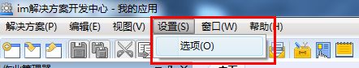
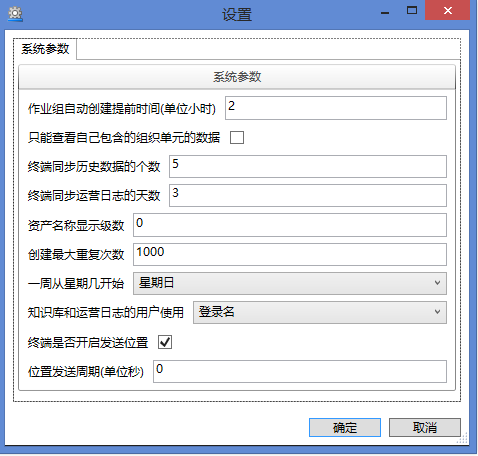

# SDC设置
在SDC中可以对系统参数进行设置，选择设置—选项，如图：

**作业组**自动创建提前时间（单位小时）：**作业组**被自动创建到手持终端的提前时间，默认为2小时。

只能查看自己包含的**组织单元**的数据：只能查看自己所属**组织单元**的数据，默认不勾选。

终端同步历史数据的个数：终端可同步的历史数据个数，默认为5个。

终端同步运营日志的天数：终端可以同步运营日志的天数，默认为3天。

**资产**名称显示级数：默认为0。

创建最大重复次数：终端**按需创建**、逻辑创建的最大次数，默认为1000次

一周从星期几开始：可以自定义每周从星期几开始，默认为星期日。

知识库和运营日志的用户使用：可以选择登录名、用户名、登录名（用户名）和用户名（登录名），默认为登录名。

终端是否开启发送位置：如果需要地图功能，需要打钩

位置发送周期（单位秒）：默认为0