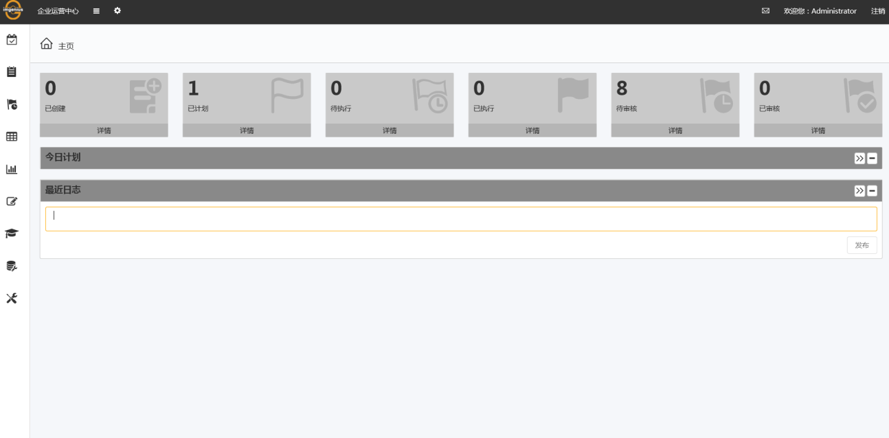

# 主页
im企业运营中心的“主页”是缺省的首页，用户也可以使用“管理”模块中的“设置首页”功能和任何页面右上角的“设置首页”快速操作键根据自己的喜好设置首页。

主页的内容是“我的**作业**”，列出了与当前用户相关的所有活动中的**作业组**。这些**作业组**还在**业务流程**中流转，并未结束归档。所有归档的**作业组**不在这里列出，用户可去“报表”中查询“归档**作业组**”的详情。

**已创建**:当前用户已经创建的计划

**已计划**:由当前用户进行了计划并创建了的**作业组**及相关概要信息 

**待执行**:目前需要当前用户执行的**作业组**以及相关概要信息

**已执行**:由当前用户在手持终端上执行并同步回传了的**作业组**及相关概要信息 

**待审核**:目前需要当前用户进行审核操作的**作业组**及相关概要信息 

**已审核**:由当前用户审核了但还未结束的**作业组**及相关概要信息

