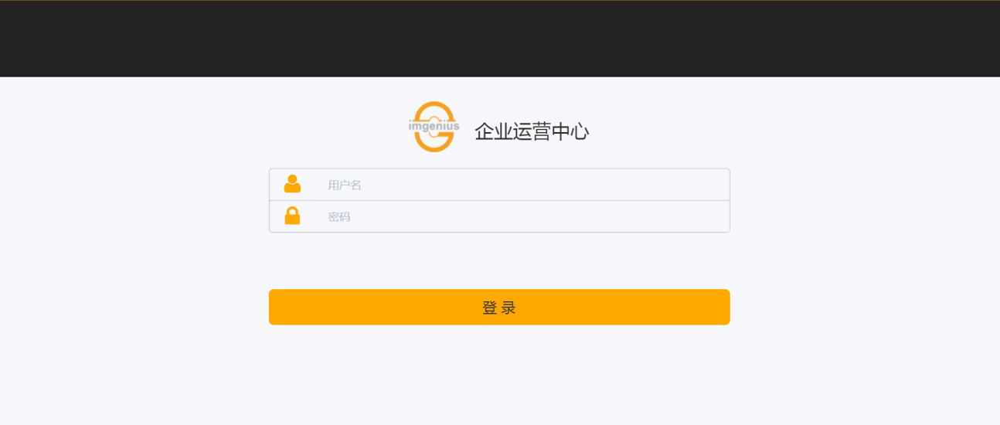

# im企业运营中心
im企业运营中心（Enterprise Operation Center, 简称imEOC）是imgenius企业移动现场**作业**管理软件的门户网站。 
im企业运营中心作为imgenius企业移动现场作业管理软件与企业用户的交互平台，企业用户登录后进行**作业**计划、**作业**审核、**作业**报表、KPI分析、日志、知识库等一系列针对**解决方案**的操作。
客户端只需要使用浏览器访问操作，无需安装任何软件或插件。im企业运营中心必须部署在IIS7或以上版本，并支持IE9.0或以上版本的浏览器。
## 登录im企业运营中心
在浏览器地址栏中输入im企业运营中心网址：

http://（企业运营中心站点名称）,进入im企业运营中心的登录界面。其中企业运营中心站点名称为您部署im企业运营中心的服务器名称或IP地址。如果im企业运营中心部署在本机，站点名称为：**http://localhost**

在用户名、密码框中输入用户的登录名及密码。
