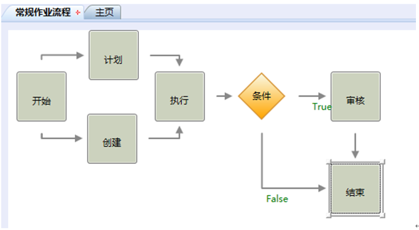

# 主要任务

* 创建一个名为“常规作业流程”的业务流程
* 如下图放置和连接活动块

  

 * 活动“计划”和“创建”的参与者由绝对人员的方式来指定，人员为：杨雪
 * 活动“执行”的参与者由角色的方式来指定，角色名为：缺省，角色的组织单位是：属于生产技术部，角色的岗位是：巡检员，角色的业务范畴为空。
 * 活动“审核”的参与者由相对人员的方式来指定，原则为活动“执行的”提交者.经理。
 * 活动“条件”的名称改为：有无例外，逻辑表达式为：最高例外等级>=普通。
