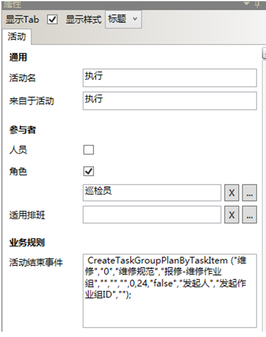
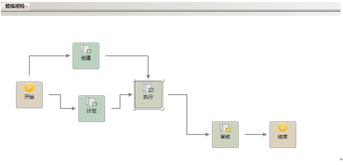

# 主要任务“管线巡检”的业务流程

* 活动“计划”和“创建”的参与者由绝对人员的方式来指定，人员为：杨雪
* 活动“执行”的参与者由角色的方式来指定，角色名为：缺省，角色的组织单位是：属于生产技术部，角色的岗位是：巡检员，角色的业务范畴为空。执行中活动结束后事件：
CreateTaskGroupPlanByTaskItem ("维修","0","维修规范","报修-维修作业组","","","",0,24,"false","发起人","发起作业组ID","");

  

CreateTaskGroupPlanByTaskItem ("维修","0","维修规范","报修-维修作业组","","","",0,24,"false","发起人","发起作业组ID","");
函数描述： 查看作业组中是否存在业务范畴和例外等级与 Catagory 和 ExceptionLevel 设定相等 的作业项，如果有符合条件的作业项，为每个符合条件的作业项创建一个作业组实例。

* 活动“审核”的参与者由相对人员的方式来指定，活动事件

  