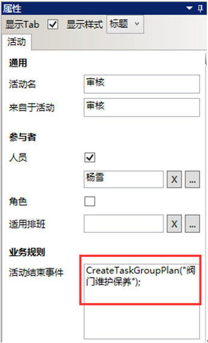
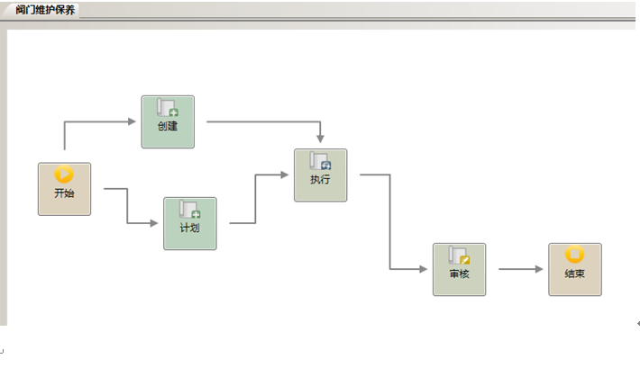

# 主要任务”阀门维护保养”的业务流程

* 活动“计划”和“创建”的参与者由绝对人员的方式来指定，人员为：杨雪
* 活动“执行”的参与者由角色的方式来指定，角色名为：缺省，角色的组织单位是：属于生产技术部，角色的岗位是：巡检员，角色的业务范畴为空。
* 活动“审核”的参与者由相对人员的方式来指定，活动事件：
CreateTaskGroupPlan("阀门维护保养");
CreateTaskGroupPlan("tgPropertyName")：流程中调用此函数，自动创建作业任 务和作业组计划，同时此计划中添加了作业任务。tgPropertyName作业组属性名称，配置信息如下：

  

  