# 详细步骤

* 创建一个名为“常规作业流程”的业务流程
选中导航栏业务流程管理器，选择我的应用并右击，选择新建，如图：

  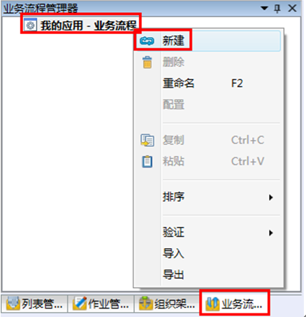

  将新建的新流程1改名为：生产一部设备巡检流程

  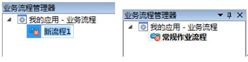

* 如下图放置和连接活动块

  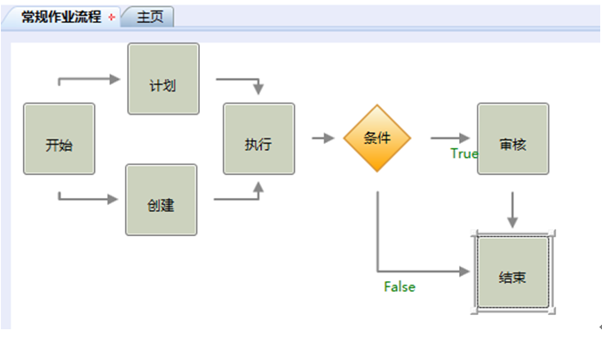

  点击右边属性栏-活动工具箱，将活动快拖拽至配置界面，如下图：

  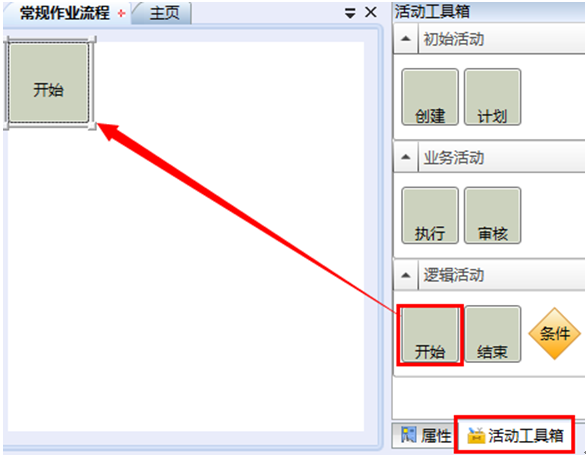

  按照以上方法放置其他活动块到指定位置，并依次连接活动块（略）。

* 活动“计划”和“创建”的参与者由绝对人员的方式来指定，人员为：杨雪
配置“计划”活动块，选中“计划”活动块，在右边属性栏勾选人员勾选框，单击扩展 按钮，在选择人员界面选择“杨雪”，如图：

  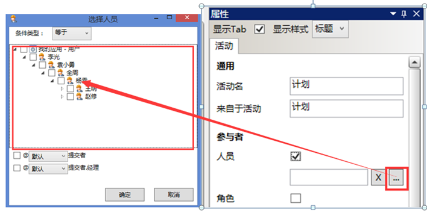

  同理为“创建”活动块配置人员“李天明”，如图：

  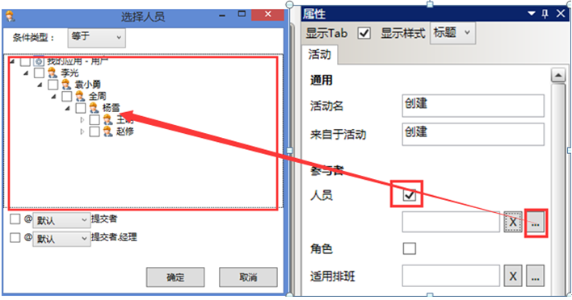

* 活动“执行”的参与者由角色的方式来指定，角色名为：缺省，角色的组织单位是：属于生产技术部，角色的业务范畴为空，角色的岗位是：巡检员。

  配置“执行”活动块，选中“执行”活动块，在右边属性栏勾选角色勾选框，单击扩展 按钮，进入选择角色界面，如图：

  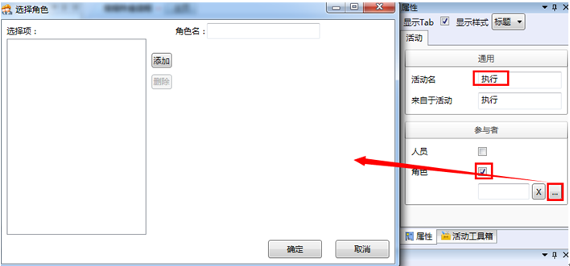

  在“选择角色”界面，单击“添加”，添加一个新角色，，角色名为：缺省，如图：

  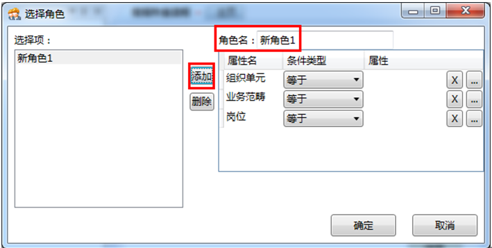

  在组织单元选择框，单击扩展 按钮，进入到选择组织单元界面，选择组织单元：生产技术部，如图：

    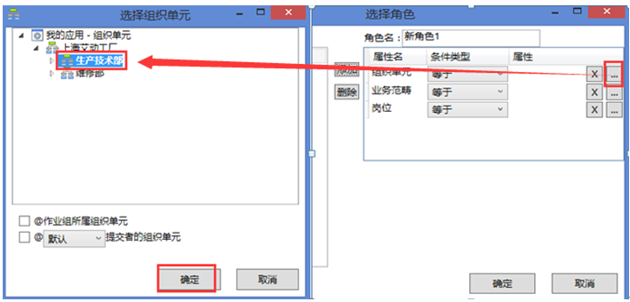

  业务范畴为空（本处无需配置），同理配置岗位，如图：

    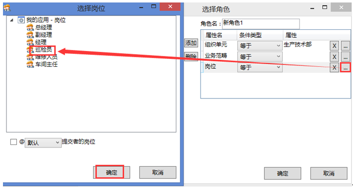

  配置完成后在选择角色界面单击确定，完成。

* 活动“审核”的参与者由相对人员的方式来指定，原则为活动“执行”提交者的经理。
配置“审核”活动块，选中“审核”活动块，在勾选人员勾选框，单击扩展 按钮，在选择人员界面勾选“提交者.经理”勾选框，如图：

    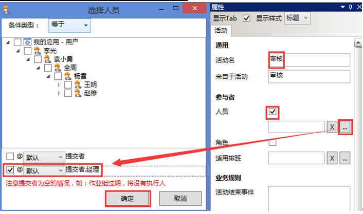

* “条件”活动块的名称改为：有无例外，逻辑表达式为：最高例外等级>=普通。
配置“条件”活动块，选中“条件”活动块，在逻辑表达式配置框选择扩展 按钮，在“条件表达式配置”界面，配置为：最高例外等级>=普通，如下图：

    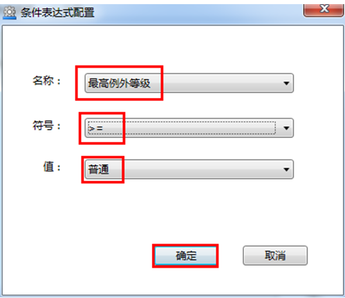

  单击保存，完成“巡检”流程配置

    

验证“巡检”，选中“巡检”，右击，验证→验证，如图：

  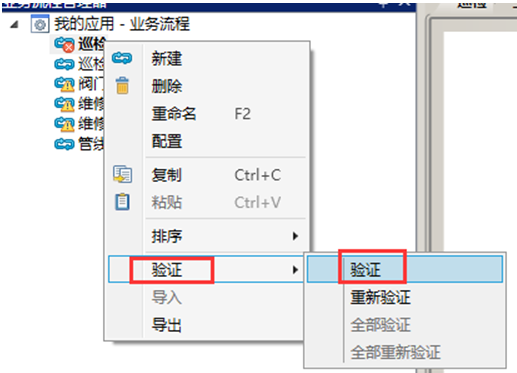

验证完成，系统弹出警告提示框，请忽略并确定，如图：

  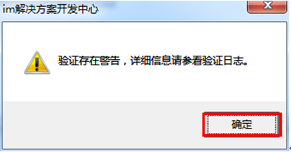

