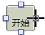
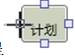

# 活动块的链接

在主工作区→我的流程配置页面内，将光标停驻在“开始”活动块边线中点处的小方格，看到光标及活动块呈  ，按住鼠标左键，拖动黑色十字光标至“计划”活动块边线中点小方格处，看到光标及活动块呈 ，松开鼠标左键，活动块间出现箭头线将两个活动块连接。

       
> [!warning] 
> 搭建条件活动连接时，注意条件块两条OUT箭头线的值。
>* True——条件表达式结果为真
>* False——条件表达式结果为假
>* 可以通过OUT箭头线的属性栏更改。