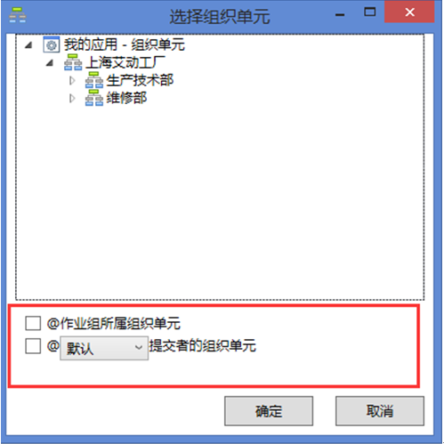

# 使用相对人员配置参与者

相对人员配置可以使用某一活动提交者（活动的实际执行人）或活动提交者的经理（活动实际执行人的经理）来指定该活动的参与者。

示例：

谁计划谁审核

执行者的经理审核

       
> [!warning] 
> 默认活动为当前活动的前一活动。
当前活动的前一活动为开始活动时不能使用默认活动。

> [!warning] 
> 选择人员对话框内，@活动提交者和@活动提交者.经理可同时配置。
