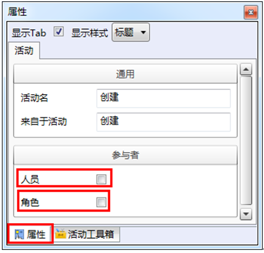
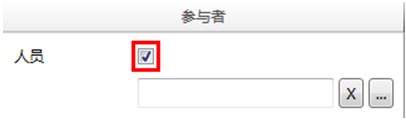
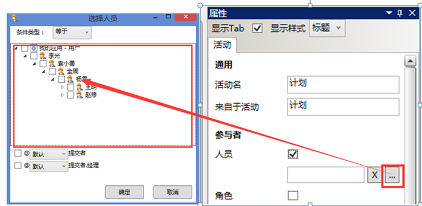

# 配置“计划”、“创建”、“执行”、“审核”活动块的参与者活动块的链接

参与者属性用于配置在此流程中能够参与实际业务活动的人员。

参与者属性下有人员和角色两种配置模式，用户可同时选取两种模式，也可配置单一模式。

## 使用绝对人员配置参与者

绝对人员配置可以指定任意的固定用户为该活动的参与者,你指定的用户有权进行相关的活动。

在参与者属性下勾选人员，出现人员配置框。 

点击扩展 按钮，进入选择人员对话框，如图：

       
> [!warning] 
> 绝对用户配置的条件类型有两种：等于和不等于。
使用绝对用户配置在用户变更时需要重新配置。
