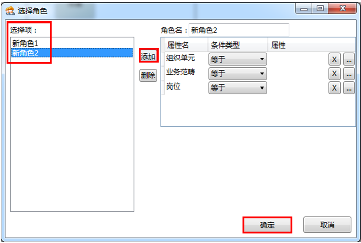

# 使用角色配置参与者

角色配置可以指定角色为该活动的参与者，角色由组织单元、岗位及业务范畴组成。

在参与者属性下勾选角色，出现角色配置框。

点击扩展 按钮，进入选择角色对话框，如图：

单击“添加”，新建一个角色，如图：

配置角色的组织单元，点击组织单元的条件类型，选择一个条件。

 * 等于：角色是所选组织单元内成员，不含所选组织单元子级组织单元内成员。

 * 不等于：角色是除所选组织单元外的其他成员（包含所选组织单元子级组织单元）。

 * 包含：角色是所选组织单元及父级组织单元内成员
 。
 * 属于：角色是所选组织单元及子级组织单元内成员。

单击对话框右侧属性卡组织单元扩展  按钮进入选择组织单元对话框，在选择组织单元选择框汇总选择角色的所属组织单元，单击确定完成。

* 绝对组织单元

绝对组织单元可以指定任意的固定组织单元为该角色的组织单元。

* 相对组织单元

相对组织单元可以@作业组的组织单元，选择应用业务流程的作业组所属组织单元为该角色相关组织单元，也可以@活动提交者的组织单元，即选取某一活动提交者的组织单元为该角色所属组织单元。

       
> [!warning] 
> 角色的组织单元具有唯一性。
配置角色的业务范畴，点击业务范畴的条件类型，选择一个条件。

 * 等于：角色的业务范畴是所选业务范畴类别内全部业务范畴或所选业务范畴。
 * 不等于：角色的业务范畴是除所选业务范畴类别、业务范畴外的其他任何业务范畴。
 * 包含：角色的业务范畴里含有所选业务范畴类别、业务范畴。单一类别的业务范畴一定包含了同时勾选了该业务范畴以及另外类别的业务范畴。
 * 属于：角色的业务范畴是所选业务范畴类别内任一业务范畴或所选业务范畴。包含关系的反面就是属于关系，A包含B意味着B属于A。

单击对话框右侧属性卡业务范畴扩展按钮 进入选择业务范畴对话框，在业务范畴列表下选择一个业务范畴为角色的所属业务范畴，单击确定完成。

* 绝对业务范畴

绝对业务范畴可以指定任意的固定业务范畴为该角色的业务范畴。

* 相对业务范畴

相对业务范畴可以勾选@作业组的业务范畴，选择作业组所属业务范畴为该角色所属业务范畴，也可以勾选@活动提交者的业务范畴，选取某一活动提交者的业务范畴为该角色所属业务范畴。

> [!warning] 
> 选择业务范畴对话框内，用户可同时组合配置勾选业务范畴类别、业务范畴以及@作业组的业务范畴、@活动提交者的业务范畴。该选择指定了这些不同类别的业务范畴的交集。
配置角色的岗位，点击岗位的条件类型，选择一个条件。

  * 等于 — 角色的岗位是所选岗位。
  * 不等于 — 角色的岗位是除所选岗位外的其他任何岗位。

单击对话框右侧属性卡岗位扩展按钮  进入选择岗位对话框，在岗位列表下选择一个岗位为角色所属岗位，单击确定完成。

* 绝对岗位

绝对岗位可以指定任意的固定岗位为该角色的岗位。

* 相对岗位

相对岗位可以勾选@活动提交者的岗位，即选取某一活动提交者的岗位为该角色所属岗位。

> [!warning] 
> 角色的岗位具有唯一性。

> [!warning] 
> 角色配置可根据用户需要选择是否配置角色的组织单元、业务范畴、岗位，或者组合配置，只要配置结果可以满足角色职责定义需要。

用户可根据需要继续添加或删除角色，添加后的配置同上，单击确定完成。

配置完成保存 后关闭。

> [!warning] 
> 在使用角色定义参与者时可以定义多个角色。