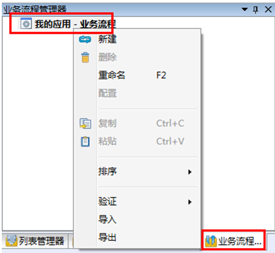

# 业务流程管理器

在imgenius企业移动现场作业管理软件中，使用im解决方案开发中心中的业务流程管理器来创建业务流程。业务流程是对企业一系列与现场作业关联的关键业务活动运转过程的描述。通过业务流程可以说明工作流程，还可以明确业务活动的参与者。活动的参与者可以使用绝对用户、相对用户和角色来定义。业务流程是由一系列的活动构成，由活动工具箱中的活动块（代表活动的图标）表示。一个业务流程必须具备“开始”和“结束”活动，也通常具有“执行”活动。

## 配置业务流程
在导航栏→业务流程管理器内右键当前应用-业务流程，在快捷菜单中即可完成业务流程的新建、删除、重命名、复制、粘贴、排序、验证、导入和导出操作

