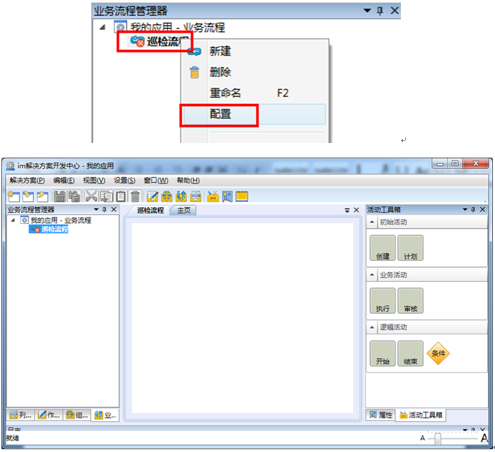
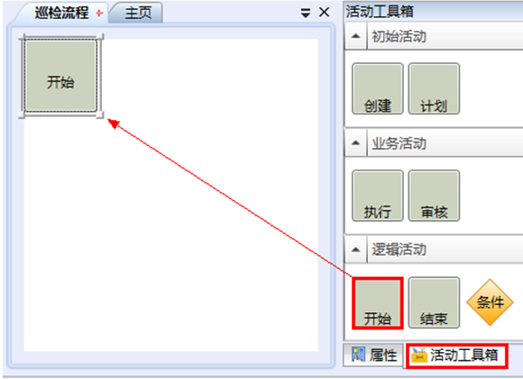
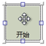

# 配置新建流程

选中一个流程，右击，在快捷菜单栏中选择配置，在主工作区出现配置流程界面。

示例：

选中“巡检流程”，右击，在快捷菜单栏中选择配置，在主工作区出现“巡检流程”的配置界面，如下图：

点击右边属性栏-活动工具箱，将活动块拖拽至配置界面，即可添加一个活动。

 示例：
 
 添加一个开始活动，如下图：

 

 * 调整活动块的高度和宽度，在主工作区→流程配置窗口内，单击鼠标左键选中活动块，看到光标及活动快呈  ，拖动活动块的四角至适宜的位置松开鼠标来改变高度和宽度。

 * 调整活动块的位置，在主工作区→流程配置窗口内，直接用光标拖动活动块即可。
