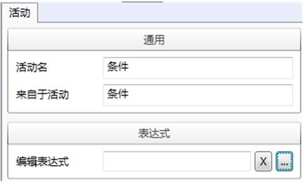
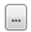
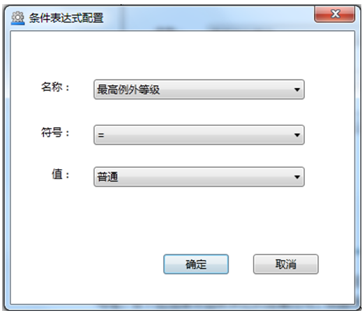
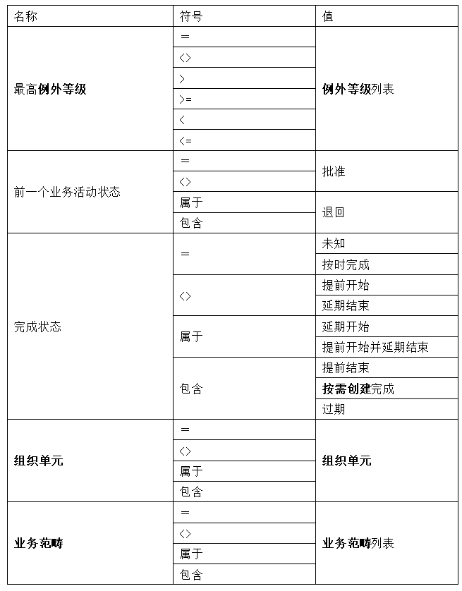
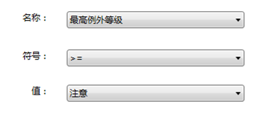
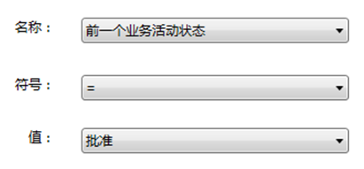

# 配置条件活动块的表达式

对于条件活动，其属性中还需要配置条件表达式。

编辑表达式框用以配置该条件活动块的逻辑表达式。点击编辑表达式框的扩展 按钮，进入条件表达式配置对话框。

在条件表达式配置对话框内，点击名称框，在下拉选择框中选取表达式条件类型，可选的表达式类型有：最高例外等级、前一个业务活动状态、完成状态、组织单元和业务范畴。

点击符号框，在下拉选择框中选取表达式运算符号，根据所选表达式条件类型，运算符号列表有所区别；

点击值框，在下拉选择框中选取表达式的值类型，根据所选表达式条件类型，值类型列表显示对应的列表项；单击确定完成。

名称、符号和值的关系如下表：

 

 示例：最高例外等级>=注意

  

 示例：前一个业务活动状态=批准

  