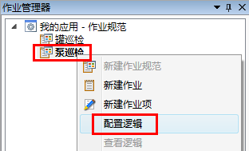

# 为作业添加逻辑
## 作业的逻辑

针对**作业**的三种系统状态：要求**作业**，不要求**作业**和禁止**作业**，允许用户配置**作业**逻辑来根据现场**作业**的情况进行动态的赋值。这里的现场作业情况可能是该**作业**本身的状态检查，也可能来自其它**作业**状态或**作业项**的值或者**资产**属性的值。

一个**作业**的逻辑可以有多条，每条逻辑可以由多个条件进行‘或’或者‘与’的运算组成。每一个逻辑均可以关联**例外等级**。其具体的配置步骤如下。

选中（作业规范）**作业**，右键，在快捷菜单栏中选择**配置逻辑**。

主工作区出现以所选**作业名**命名的逻辑编辑器选项卡，如图： 

单击选项卡上方**添加逻辑**按钮，添加一个逻辑。选项卡内出现一个逻辑项目条:

