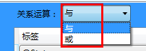
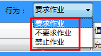
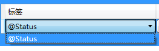
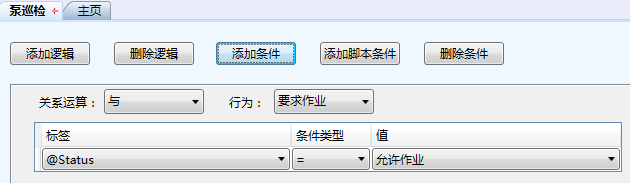
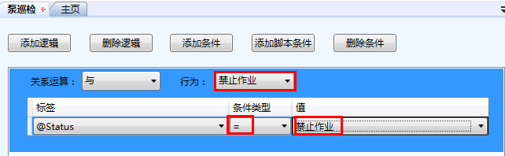

### 配置“添加条件”
在选项卡内选中添加的逻辑，单击**添加条件**按钮，为选中逻辑配置**逻辑条件**。
点击“**关系运算**”复选框 ，在下拉选单中选择该逻辑内逻辑条件的运算关系，如图：

点击“**行为**”复选框，在下拉选单中选择逻辑行为，如图：

在添加的条件项目条上，单击标签框，在下拉选单中选择一个标签类型，如图：

单击条件类型复选框，在下拉选单中选择一个运算符，imgenius中预设如下14种运算符：

* **=** 等于

* **<>** 不等于

* **>=** 大于等于

* **<=** 小于等于

* **>** 大于

* **<** 小于

* **↗>** 持续上升次数大于，该**作业项**连续**作业**的多次数值持续上升的次数是否大于某值

* **↗<** 持续上升次数小于，该**作业项**连续**作业**的多次数值持续上升的次数是否小于某值

*  **↘>** 持续下降次数大于，该**作业项**连续**作业**的多次数值持续下降的次数是否大于某值

* **↘<** 持续下降次数小于，该**作业项**连续**作业**的多次数值持续下降的次数是否小于某值

* **↗↘>** 连续变化次数大于，该**作业项**连续**作业**的多次数值连续变化的次数是否大于某值

* **↗↘<** 连续变化次数小于，该**作业项**连续**作业**的多次数值连续变化的次数是否小于某值

* **→>** 连续不变次数大于，该**作业项**连续**作业**的多次数值连续不变下降的次数是否大于某值

* **→<** 连续不变次数小于，该**作业项**连续**作业**的多次数值连续不变下降的次数是否小于某值

注意：重复以上步骤，可添加更多逻辑。

示例：

**作业**逻辑要求，当“作业模式”为“禁止作业”，作业禁止。

选中**作业**“泵巡检”，右击，在快捷菜单栏中选择**配置逻辑**，在**配置逻辑**页面单击“添加逻辑”，再单击“添加条件”，如图：

修改行为：禁止**作业**，修改值：禁止**作业**，如图：

单击保存后关闭。