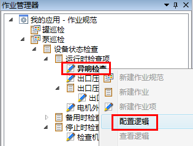
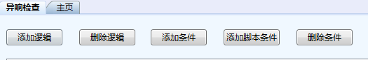
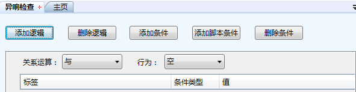

## 作业项的逻辑
**作业项**逻辑是现场作业指导的知识库，它定义了当现场出现何种情况时，需要怎样的处理。例外也是由**作业项**逻辑产生的。其定义与**作业**逻辑的定义非常类似，主要区别在于**作业项**逻辑支持的行为不再是是否需要执行，而是手持终端上的行为。具体的**作业项**逻辑行为包括：

* **空**：不发生任何行为，通常用来将此逻辑关联一个**例外等级**，作为一个例外在im企业运营中心展现。

* **文字记录**：当该逻辑发生时，允许用户在手持终端上添加文字记录，说明情况。

* **信息提示**：用户在该逻辑的属性窗口配置相关的信息提示内容。当该逻辑发生时，手持终端将会以通知的方式提示该信息。用于常规的现场**作业**例外处理提示。

* **跳转**：允许用户指定该逻辑发生时，应该跳转到某个**作业**或**作业项**去执行。跳转目标以引用名在属性窗口中配置。

* **拍照记录**：当该逻辑发生时，允许用户在手持终端上进行现场拍照，记录情况。一次可以拍多张照片。 

* **创建作业**：触发逻辑可以在手持终端创建一个**作业组**或在本**作业组**内创建一个引用作业规范执行。

示例：

选择异响检查，右键，在快捷菜单栏中选择**配置逻辑**。

主工作区出现以所选**作业名**命名的逻辑编辑器选项卡，如图：

单击选项卡上方**添加逻辑**按钮，添加一个逻辑。选项卡内出现一个逻辑项目条：

