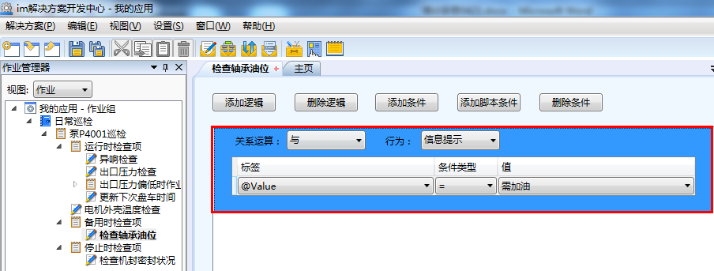
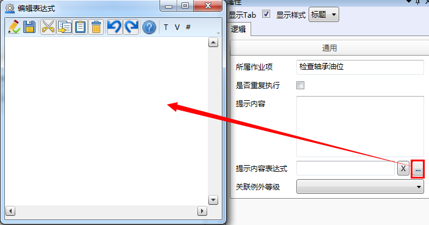
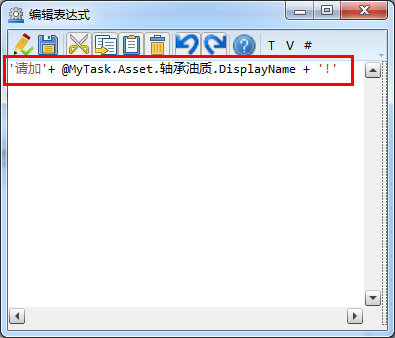
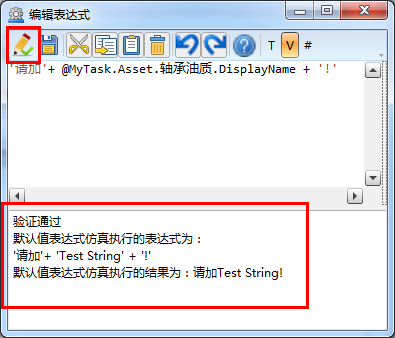

### 提示信息表达式
在**作业项**逻辑配置中，若行为选择为**信息提示**，那么在右边属性框可以配置提示内容表达式

示例：当“检查轴承油位”**作业项**，用户选择“需加油”时，信息提示该设备需要加的油品号

选中“检查轴承油位”**作业项**，右击，在快捷菜单栏中选择**配置逻辑**，在逻辑配置界面选中行为为：信息提示的逻辑，如图：

在右边属性栏，提示内容表达式框中单击扩展按钮，进入到编辑表达式界面，如图：

在编辑表达式界面，编辑如下表达式，如图：

完成后单击按钮，系统对表达式进行验证，如图：

注意：
在编写JAVA脚本时，变量后需要加空格。

在编写JAVA脚本时，字符串需要用单引号。

在编写JAVA脚本时，标点符号需要使用英文输入法输入