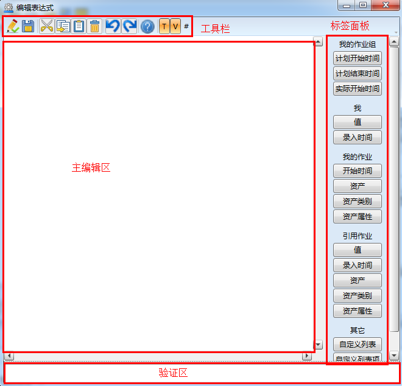
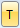
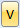
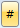
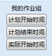
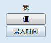
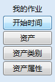
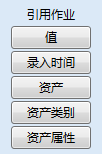
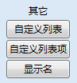

### 表达式编辑器
表达式编辑器介绍，如图：

验证：验证表达式

保存：保存表达式

验证：验证表达式剪切：剪切选中的表达式

验证：验证表达式复制：复制选中的表达式

验证：验证表达式粘贴：粘贴复制的表达式

验证：验证表达式删除：删除选中的表达式

验证：验证表达式撤销：撤销最近的一步操作

验证：验证表达式重做：重做最近的一步操作

验证：验证表达式帮助：JavaScript联机帮助

标签版面：显示\隐藏标签版面

验证：显示\隐藏验证版面

行号：显示\隐藏行号

在标签版面面板下有如下预设的变量：

* 我的**作业组**：

计划开始时间（**作业组**计划开始的时间），预定义的变量为：

@MyTaskGroup.PlannedStartTime

计划结束时间（**作业组**计划结束的时间），预定义的变量为：

@MyTaskGroup.PlannedEndTime

实际开始时间（**作业组**实际开始的时间），预定义的变量为：

@MyTaskGroup.ActualStartTime

* **我**

值（**作业**或**作业项**实际录入的值），预定义的变量为：@Me.Value

录入时间（**作业**或**作业项**数据实际录入时间），预定义的变量为：@Me.TimeStamp

* 我的**作业**

开始时间（执行时**作业**的开始时间）：@MyTask.StartTime

**资产**（执行时**作业**的资产）：@MyTask.Asset 

**资产类别**（执行时**作业**的**资产类别**）：@MyTask.AssetType

**资产**属性（执行时**作业**的**资产**属性）：@MyTask.Asset.属性名 

* 引用**作业**

值（引用**作业**的值）：@引用名.Value 

录入时间（引用**作业**的值的录入时间）：@引用名.TimeStamp 

**资产**（引用**作业**的资产）：@引用名.Asset 

**资产类别**（引用**作业**的**资产类别**）：@引用名.AssetType 

**资产**属性（引用**作业**的**资产**属性）：@引用名.Asset.属性名 	

* 其他

**自定义列表**：@CustomList.列表名

**自定义列表项**：@CustomList.列表名.列表项名

**显示名**：.DisplayName 
注意：脚本表达式的编辑使用的是JavaScript，用户可以使用帮助按钮联机查看需要的脚本表达式格式及如何编写等。