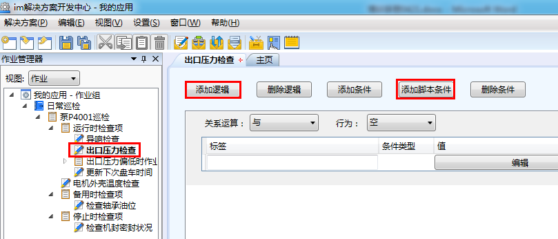
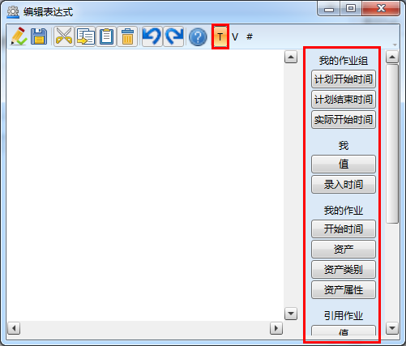
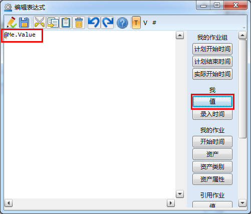
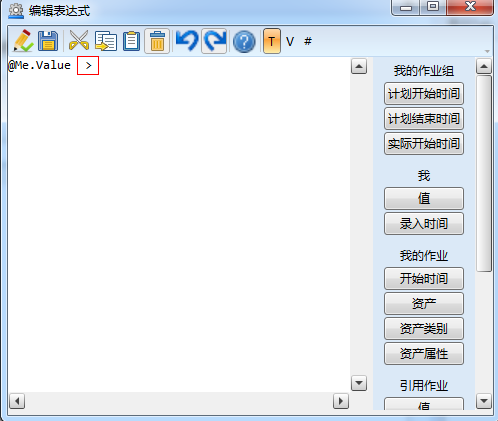
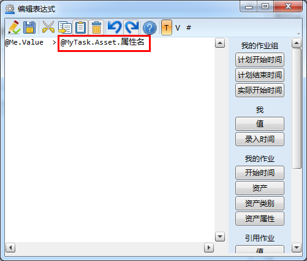
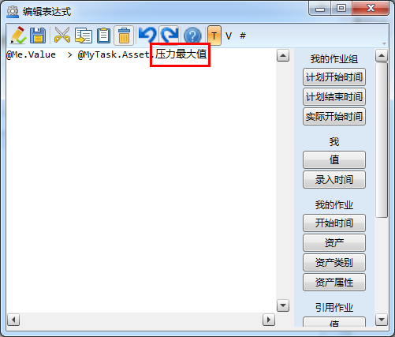
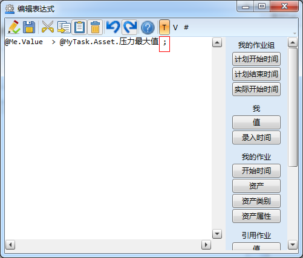
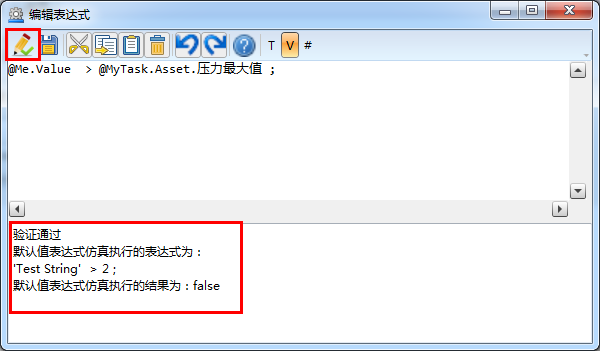

### 表达式逻辑
在**作业**或者**作业项配置逻辑**时，在“添加条件”后可以单击“添加脚本条件”，添加一个表达式逻辑。

示例：为**作业项**“出口压力检查”配置压力最大值和压力最小值表达式
选中“出口压力检查”**作业项**，右击，在快捷菜单栏中选择**配置逻辑**，单击“添加条件”，再单击“添加脚本条件”，如图：

点击“编辑”进入到编辑表达式界面，点击，打开标签版面，如图：

单击右边标签版面“我-值”，如图：

系统自动出现 @Me.Value（我的值），在@Me.Value（我的值）后面空格，输入（英文状态下）：>  ，如图：

输入完成后再次空格，单击“我的**作业-资产**属性”，如图：

修改属性名为：压力最大值（资产属性名），如图：

修改完成后输入（在英文状态下）;（分号），如图：

完成后单击按钮，系统对表达式进行验证，如图：

