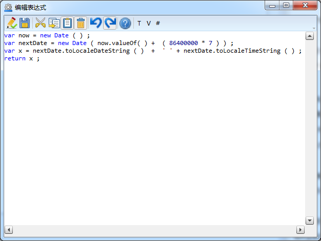

### 默认值表达式
在**作业**或**作业项**上用户可以添加一个表达式来作为该**作业**或**作业项**的**默认值表达式**。

选中一个**作业**或**作业项**，在右边属性栏中单击**默认值表达式**的扩展按钮，进入到编辑表达式框，如图：

示例：使用脚本表达式表示更新下次盘车时间为：今天+7，如图：

选中“更新下次盘车时间”，在右边属性栏单击**默认值表达式**的扩展按钮，进入到编辑表达式框，如图：

在编辑表达式界面编写如下表达式，如图：

编写完成后单击验证按钮，系统对表达式进行验证，如图：

默认表达式编写完成。