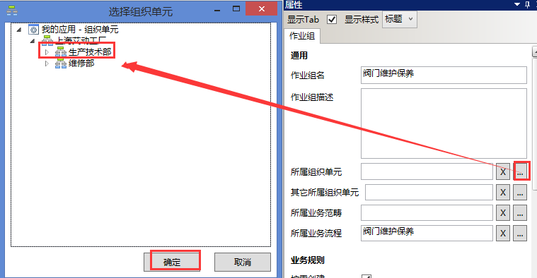
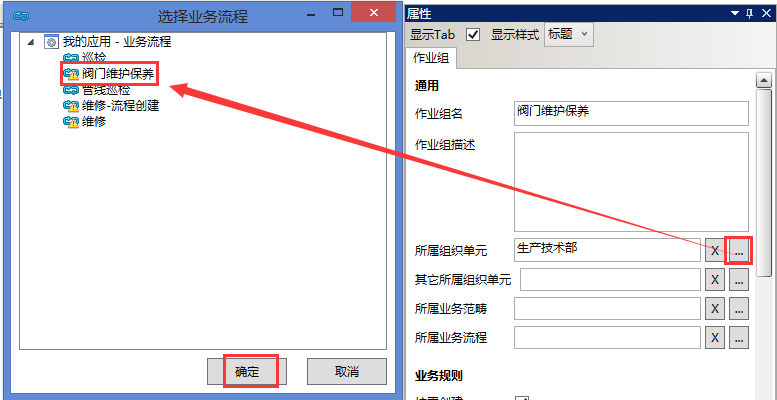
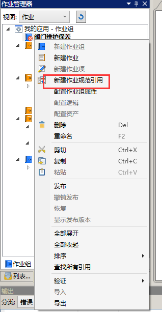
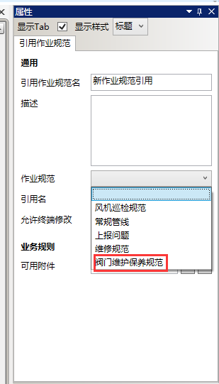
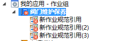
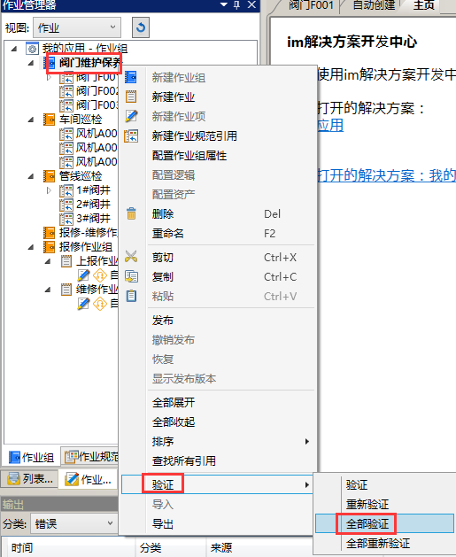
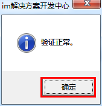
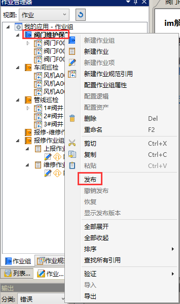
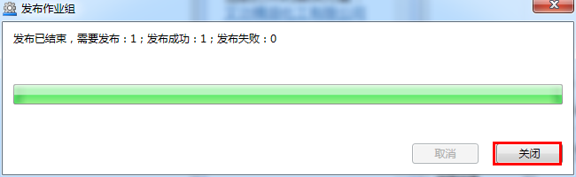

### 详细步骤
1. 新建名为“阀门维护保养”的作业组，作业组描述为空。（略）

2. “阀门维护保养”**作业组**所属**组织单元**为甲班，所属**业务流程**为：阀门维护保养流程，所属**业务范畴**为：空。

配置所属**组织单元**，选择扩展按钮，甲班，如下图：

配置所属**业务流程**，选择扩展按钮，选择“阀门维护保养”，如下图：

3. 在“阀门维护保养”**作业组**下新建三个作业规范引用

4. **作业组关联资产属性**：1号装置. 阀门F001  、1号装置. 阀门F002、1号装置. 阀门F003

5. 验证“阀门维护保养”**作业组**

选中“阀门维护保养”**作业组**，右击，验证→全部验证，如图：

点击验证后，系统弹出验证正常对话框，确定后结束，如图：

6. 发布“阀门维护保养”**作业组**

选中“阀门维护保养”**作业组**，右击→发布，如图：

点击发布后，系统自动弹出进度条，待进度条完成后，点击关闭，如图：

