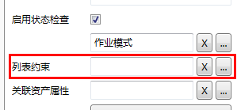

### 作业的通用属性
* **作业名**：**作业**的名称，**作业**的复合名称必须唯一。 

* **作业描述**：对该**作业**的描述信息。

* **启用状态检查**：是否该**作业启用状态检查**。状态检查是一个列表数据类型，因此当启用状态检查后，需要对列表**数据类型**进行相关配置。包括

  * **列表名**：列表**数据类型**的自定义列表名
  * **列表约束**：列表的关联关系（如果有）
  * **关联资产属性**：关联的**资产**属性名（如果有）
  * **以属性值为默认值**：将**关联资产属性**的值读取为列表的默认值。
  * **更新资产属性值**：将列表的值更新为**关联资产**属性的值。
  * **默认值**：指定列表的**默认值**（如果需要）。
  * **默认值表达式**：定义计算**默认值**的表达式（如果需要）。
  * **重复计算默认值**：在使用**默认值表达式**计算**默认值**时，无论是否已有计算结果，都进行再次运算的选项。

勾选“**启用状态检查**”后，用户必须通过扩展按钮选择一个列表作为状态检查，并且出现“**列表约束**”选择框，如图：

注意：本处“**列表约束**”为缺省值，无需配置。

* **引用名**：同一个**作业组**的其他**作业**或**作业项**可以使用此名来引用该**作业**。

* **允许查看历史数据**：是否允许手持终端查看该**作业**状态的历史数据，仅在启用**状态检查**时有效。

* **允许终端修改**：是否允许手持终端修改该**作业**。

* **相关业务范畴**：关联的**业务范畴**，用于在EOC数据查询时方便检索查询。
