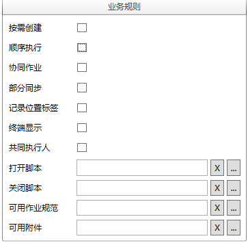

### 配置作业组业务规则
配置**作业组**业务规则具备以下六个参数：

* **按需创建 - 按需创建**的**作业组**允许执行活动的参与者直接在手持终端上创建此**作业组**实例。

* **顺序执行 - 顺序执行**的**作业组**要求其下第一层**作业**必须按照顺序来完成。 

* **协同作业 - 一个作业组一个人完成不了，需要多人共同来完成**。

* **部分同步 - 部分同步**的**作业组**允许手持终端在**作业组**没有完成的情况下，将部分已经完成的**作业**或**作业项**结果同步回im数据中心。

* **记录位置标签**：决定是否记录该**作业组**所有数据的位置标签，位置标签可以来至于扫描点或GPS。

* **终端显示**：当配置了“按需创建”的时候，配置了终端显示，我们在终端才能看到这个**作业作业组**。

* **共同执行人**：在**作业组**完成之后需要记录一个人或者多人员，一同完成该**作业**的人员情况。

* **打开脚本**：该脚本在**作业组**打开的时候执行。

* **关闭脚本**：该脚本在**作业组**确定已经完成的时候执行。

* **可用作业规范**：指定此**作业组**可以引用的**作业规范**。

* **可用附件**：指定此**作业组**可以使用的**附件**。

