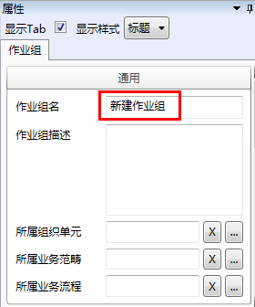

### 配置作业组通用属性
**作业组**通用属性除名称和描述外，还有“所属**组织单元**”、“所属**业务范畴**”和“所属**业务流程**”。其中，所属**组织单元**和**业务流程**是必须配置的，所属**业务范畴**并非一定要配置。

更改新建的**作业组**名称，或者在属性栏**作业组名**框中输入**作业组名称**。

**所属组织单元**：指定该**作业组**的**组织单元**属性的值，此**作业组**的数据属于指定的**组织单元**。如果选择了“只能查看自己包含的**组织单元**的数据“选项，只有所属**组织单元**的成员才能查看此**作业组**的数据。

**所属业务范畴**：指定该**作业组业务范畴**属性的值。

**所属业务流程**：指定该**作业组**的**业务流程**。
