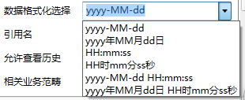

### 数据类型
在**作业项**中需要选择相应的**数据类型**，imgenius支持种**数据类型**：
* 列表
* 数值
* 字符串
* 可输入列表
* 签名
* 日期时间
* 文件
* 多选列表
* Json字符串

列表**数据类型**

imgenius使用**列表管理器-自定义列表**选项卡来预设列表，这些预设的**列表项**将出现在手持终端上的相关**作业**中，供操作员在现场根据实际情况选择。这些预设的列表被统称为列表**数据类型**。

数值**数据类型**

imgenius使用数值**数据类型**来表示一个模拟量，**数值数据**类型包括整型、浮点数（科学计数法表示）和带小数的实数类型。数值数据的类型通过**数据格式化选择**来定义。imgenius的缺省数据格式如下图：

格式：
{0:D} ：为整数

{0:E} ：浮点型

{0:N} ：表示有两位小数的实数，等同于{0:N2}

{0:N3}：表示有三位小数的实数

{0:N4}：表示有四位小数的实数

数值**数据类型**通常还需要定义**工程单位**，**工程单位**可以在**列表管理器-工程单位**中配置和修改。

字符串**数据类型**

imgenius使用字符串类型来表示字符串，在脚本编辑器中以单引号来表示一个字符串常量，在其他地方则无需单引号。

可输入列表**数据类型**

imgenius使用可输入列表**数据类型**来表示可以用户输入也可以在预设**列表项**中选择的**数据类型**。同样使用**列表管理器-自定义列表**选项卡来预设列表。可输入列表的用户输入项可以通过审核的添加功能自动添加到预设列表的**列表项**中。

签名**数据类型**

imgenius使用真人笔迹来作为签名。

日期时间**数据类型**

imgenius使用日期时间数据类型来表示时间，日期时间**数据类型**有六种格式，如下图：

其中包括两种日期类型，两种时间类型和两种日期和时间类型。不同的格式对应不同的初始数据。

* 日期类型

日期类型的初始数据可以由日历工具来设定一个绝对日期，也可以由imgenius预定义的日期名来设定一个相对日期，这些日期名包括：今天、本周末、本月末、本周初、本月初、本季初、本季末。日期类型的初始数据由**默认值**或**默认值表达式**来定义。还可以使用加减法来表示和这些预定义日期名相同单位的偏移量。
示例：
“今天-2”表示前天。

“本周初-1”表示上周初。

* 时间类型

时间类型的初始数据在默认值框中由时间设定工具来设定。

示例：

表示**默认值**为上午11点22分33秒。

表示当前时间的时分秒各加1后计算出的时间。

* 日期和时间类型

日期和时间类型的初始数据由以上两种方法共同设定。

**文件数据类型**

Imgenius目前不支持

**多选列表数据类型**

imgenius使用**列表管理器-自定义列表**选项卡来预设列表，这些预设的**列表项**将出现在手持终端上的相关**作业**中，供操作员在现场根据实际情况选择，可以进去多选。

**Json字符串数据类型**

作业项内容不定，有些可能多个，可以输入多个，起到记录作用

如：记录配件，同时记录什么配件，也同时需要记录数量，我们有时可以配置成一个作业项，就用到Json字符串数据类型

若**数据类型**选择列表或者可输入列表，并且通过扩展按钮选择一个列表作为状态检查，那么会出现“**列表约束**”选择框，如图：

注意：本处“**列表约束**”为缺省值，无需配置。

**关联资产属性**：关联一个**资产**属性
  1. **以属性值为默认值**：将资产属性的缺省值读取并成为本处的**默认值**。
  1. **更新资产属性值**：将本处选择的值更新为**资产**属性的缺省值。
  1. **默认值**：默认一个值。
  1. **默认值表达式**：用表达式来确定一个**默认值**。
  1. 重复计算**默认值**：当巡检员退回上一步，再次执行本步时，可以重新计算该值。

* **这是一个序列**：勾选此选项后，**作业人员**可以在手持设备上多次输入值，在“序列最大长度”文本框中配置输入值的次数，例如：3，表示可以最多输入3次值，也可以输入1次或者2次。

* **数据输入方式**：imgenius提供以下几种数据输入方式：
  * **条码**：手持终端扫描条码ID输入 
  * **RFID**: 启用RFID射频识别电子标签ID输入 
  * **VIBTool**: 通过VIBTool测量仪器测量相关数值并输入 
  * **OptrisMS**：通过OptrisMS红外测温仪测量相关数值并输入 

注意：**VIBTool** 和 **OptrisMS** 这两种数据输入方式需要预先与手持设备进行蓝牙配对，配对成功后才可使用。

* **字段名**：字段名根据选择的数据输入方式而不同,imgenius系统中预设了以下字段名，预设的字段名无法被修改。
  * **条码\ RFID**的**字段名**：ID
  * **VIBTool**的**字段名**:
  
  * **OptrisMS**的**字段名**：温度

* **允许手动输入**：允许用户手动输入数值，字符串。
* **引用名**：同一个**作业组**的其他**作业**或**作业项**可以使用此名来引用该**作业**。 
* **允许查看历史**：是否允许手持终端查看该**作业**状态的历史数据。
* **相关业务范畴**：关联的**业务范畴**，用于在EOC数据查询时方便检索查询。