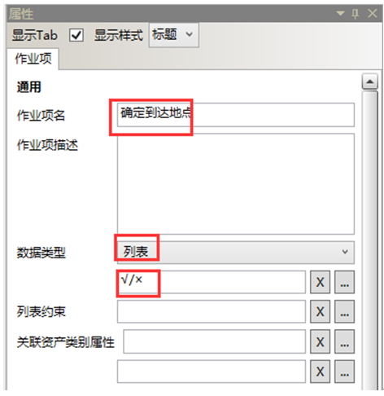
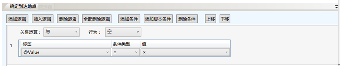
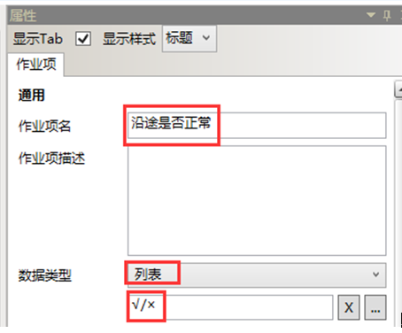

# 主要任务

* 新建“常规管线”作业规范，关联资产类别为：管线。
在“常规管线”作业规范下新建一个名为“确定到达地点”的作业项，数据类型为：列表，默认值为：√，其他项默认缺省值（无需配置）。

  

  

  再新建一个“沿途是否正常”的作业项，数据类型为：列表，如果值=×，执行脚本信息，关联例外等=注意，

   

  再新建一个“沿途是否正常”的作业项，数据类型为：列表，如果值=×，执行脚本信息，关联例外等=注意，

  脚本如下：

````javascript
var resultName = ScriptEngine.GetResultName();
ScriptEngine.Context.SetTaskAttributeValue(contextID,'RuntimeRelatedBDIDString','作业业务范畴.维修',function(){
    ScriptEngine[resultName] = true;
}) ;
return {'ResultName':resultName};”
````
该脚本主要是在常规管线的巡检过程中发现了设备问题，马上就可以生成一个报修的作业组

* 新建一个名为“常规管线”的作业组，作业描述为空，所属组织单元为：生产技术部，所属业务范畴为空，所属业务流程为：常规管线。作业组下引用三次“常规管线”作业规范，分别关联1#阀井~ 3#阀井。

* 新建“风机巡检规范”作业规范，关联资产类别为：风机。

* 在“风机巡检规范”作业规范下新建一个名为“异常检查”的作业项，数据类型为：列表，默认值为：是，其他项默认缺省值（无需配置）。再新建一个“电机轴承温度记录”的作业项，数据类型为：数值，工程单位：℃，其他项默认缺省值（无需配置）验证并发布“风机巡检规范”作业规范,

