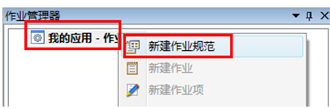
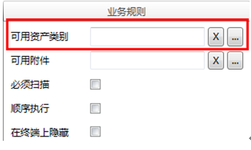

# 作业规范、作业组
作业规范：在imgenius中，将同类资产的作业定义为作业规范，作业规范的配置同作业组的配置，作业规范的引用可以重用代码，在单一修改点完成作业内容的修改。在作业对象未定时按需创建。

作业组：在imgenius企业移动现场作业管理软件中，使用im解决方案开发中心→作业管理器来配置和管理代表企业实际现场作业的作业组和作业规范。 

作业规范是imgenius企业移动现场作业管理系统提供的作业模版，一个作业规范允许在一个或多个作业组内引用。

作业项对应现场工作中的一项工作，可指定一种数据变量类型。

作业是作业项和作业的集合，即作业下可嵌套作业，作业可以来自作业规范的引用，作业通常包含一个资产的所有作业项。

作业组是某一个现场一次出去工作中所有任务的集合，是一个树状视图。

## 新建作业规范

在导航栏→作业管理器→作业规范内右键当前应用-作业规范，在快捷菜单中选择新建作业规范，如图：

## 作业规范的配置

作业规范的配置同作业的配置，区别是作业需要关联一个绝对资产而作业规范需要关联一个资产类别，如图：

