# LAB18 创建维修作业规范，并创建“报修-维修作业组”作业组和“报修作作业组”作业组

新建“维修规范”作业规范，关联资产类别为：风机、阀门、管线。

* 在“维修规范”作业规范下新建一个名为“修改作业组名称”的作业项


 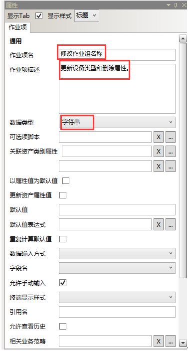

 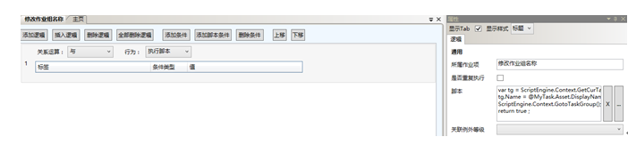

 执行脚本：
````javascript
var tg = ScriptEngine.Context.GetCurTaskGroup();
tg.Name = @MyTask.Asset.DisplayName + '维修' ;
ScriptEngine.Context.GotoTaskGroup();
return true ;
````

* 作业项2：故障原因

 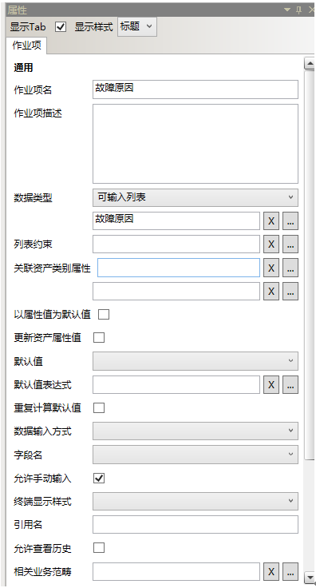

 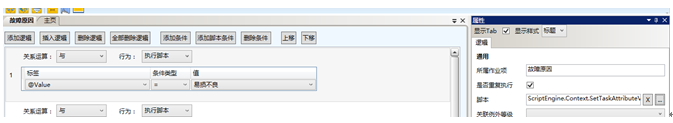


执行脚本：
````javascript
ScriptEngine.Context.SetTaskAttributeValue(contextID,'RuntimeRelatedBDIDString','故障原因.易损不良') ;
````
 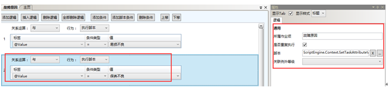

````javascript
ScriptEngine.Context.SetTaskAttributeValue(contextID,'RuntimeRelatedBDIDString','故障原因.保养不良') ;
````
 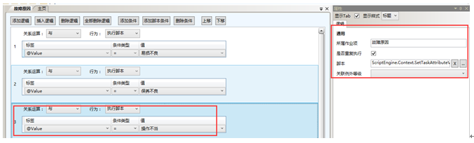

````javascript
ScriptEngine.Context.SetTaskAttributeValue(contextID,'RuntimeRelatedBDIDString','故障原因.操作不当') ;
````
 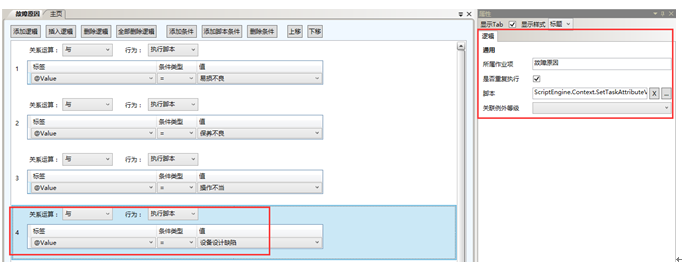

````javascript
ScriptEngine.Context.SetTaskAttributeValue(contextID,'RuntimeRelatedBDIDString','故障原因.设备设计缺陷') ;
````
 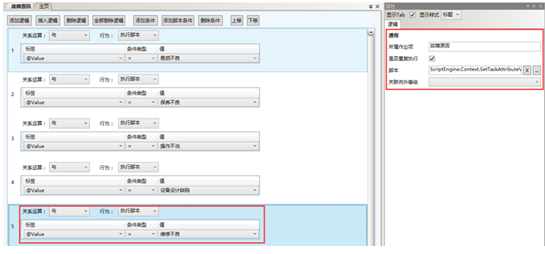

````javascript
ScriptEngine.Context.SetTaskAttributeValue(contextID,'RuntimeRelatedBDIDString','故障原因.维修不良') ;
````
 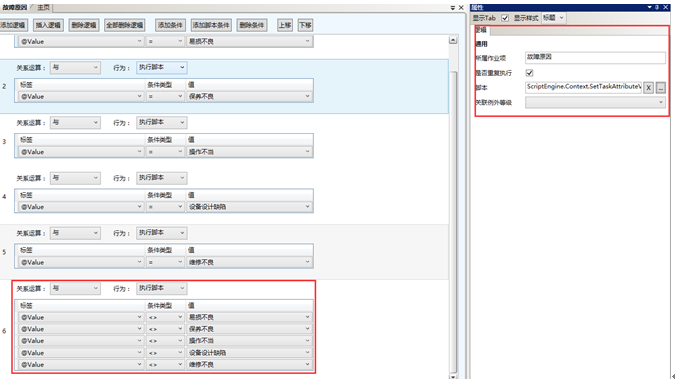

````javascript
ScriptEngine.Context.SetTaskAttributeValue(contextID,'RuntimeRelatedBDIDString','故障原因.其它') ;
````

* 作业项3：维修措施

 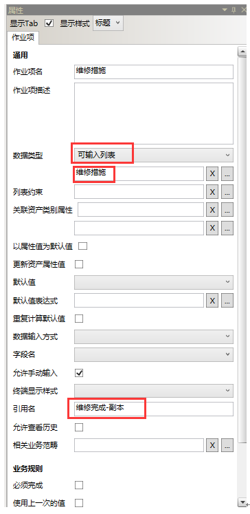

 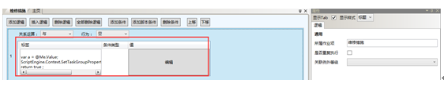

 脚本：

 ````javascript
var a = @Me.Value;
ScriptEngine.Context.SetTaskGroupPropertyValue('维修措施', a) ;
return true ;
````
 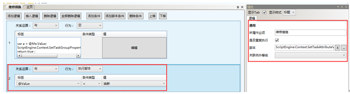

````javascript
ScriptEngine.Context.SetTaskAttributeValue(contextID,'RuntimeRelatedBDIDString','维修措施.换新') ;
````
 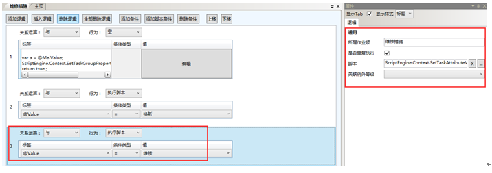

````javascript
ScriptEngine.Context.SetTaskAttributeValue(contextID,'RuntimeRelatedBDIDString','维修措施.维修') ;
````
 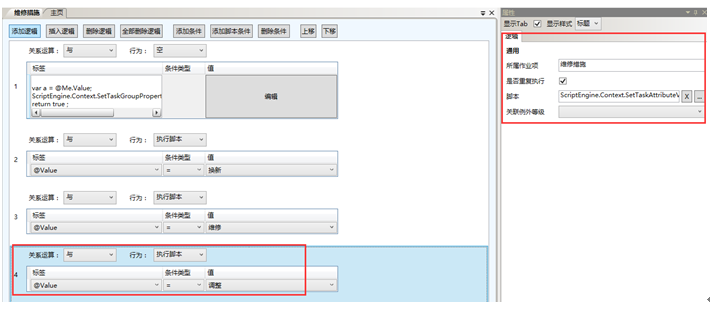

````javascript
ScriptEngine.Context.SetTaskAttributeValue(contextID,'RuntimeRelatedBDIDString','维修措施.调整') ;
````

* 作业项4：改善意见

 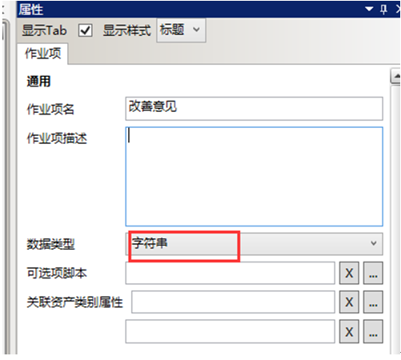


* 作业项5：维修是否完成

 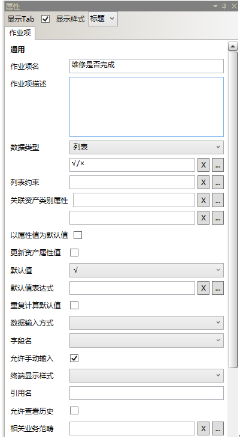

 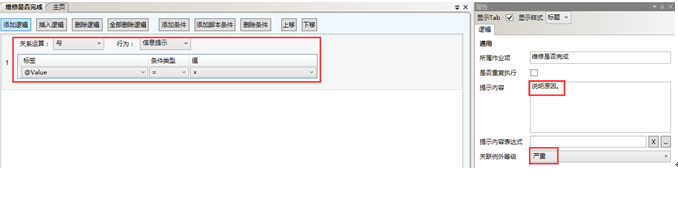 

 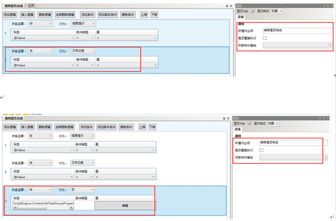
 

 脚本
 ````javascript
ScriptEngine.Context.SetTaskGroupPropertyValue('维修完成', @Me.Value ) ;
````

* 作业项6：更换配件

 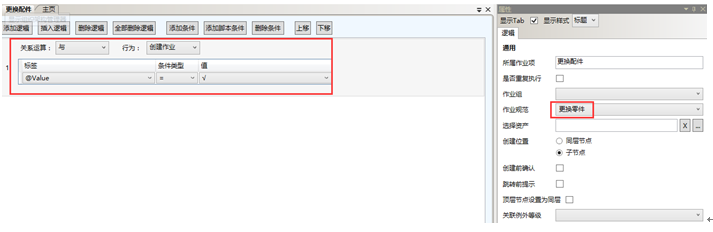  

 配置完成后：

 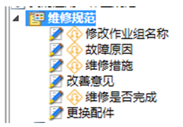  