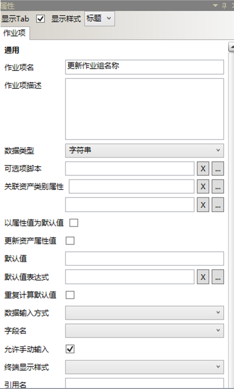
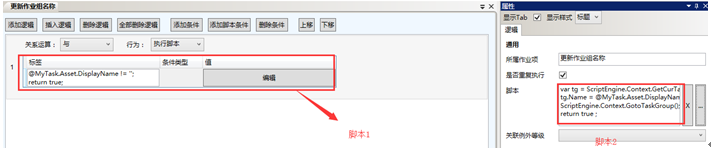
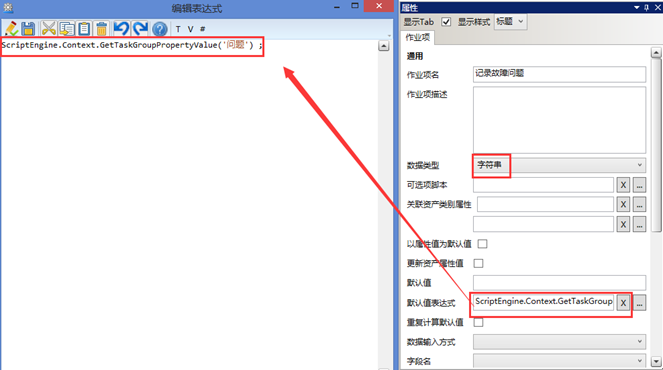
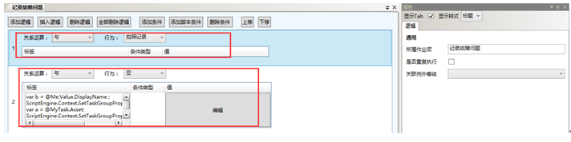

# 配置上报问题规范

* 作业项1：更新作业组名称


  

作业项：更新作业组名称

  

脚本1：
````javascript
@MyTask.Asset.DisplayName != '';
return true;
````
脚本2：
````javascript
var tg = ScriptEngine.Context.GetCurTaskGroup();
tg.Name = @MyTask.Asset.DisplayName + '-问题上报' ;
ScriptEngine.Context.GotoTaskGroup();
return true ;
````

* 作业2：记录故障问题

  

  脚本如下: 
  ````javascript
  ScriptEngine.Context.GetTaskGroupPropertyValue('问题') ;
  ````
  逻辑配置如下：
  

  脚本如下: 
  ````javascript
  var b = @Me.Value.DisplayName ;
  ScriptEngine.Context.SetTaskGroupPropertyValue('问题', b );
    var a = @MyTask.Asset;
    ScriptEngine.Context.SetTaskGroupPropertyValue('资产ID', a) ;
    return true ;

    ````