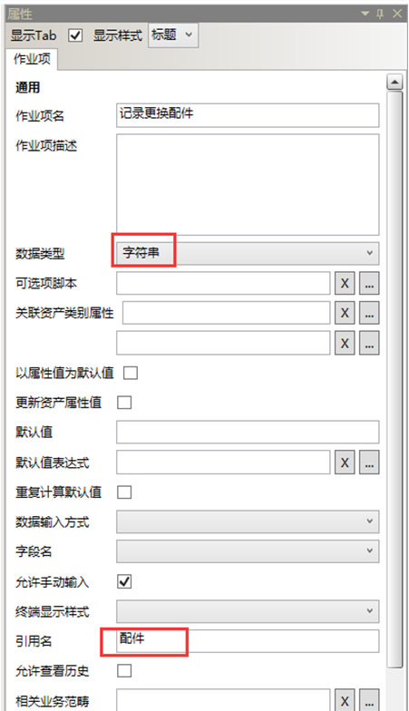
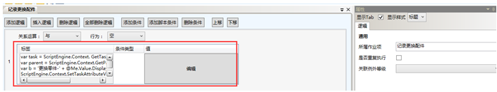
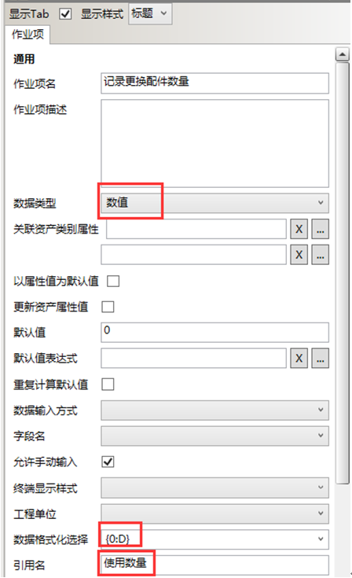
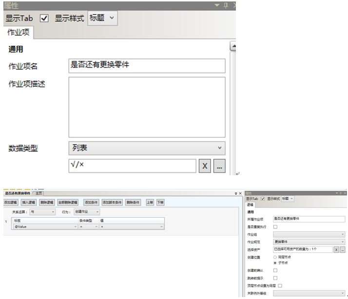
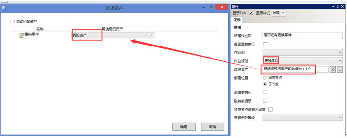

# 配置更换零件规范

* 作业项1：记录更换配件


  

  

 执行脚本：
````javascript
var task = ScriptEngine.Context. GetTaskByID(contextID);
var parent = ScriptEngine.Context.GetParentTask(task);
var b = '更换零件-' + @Me.Value.DisplayName ;
ScriptEngine.Context.SetTaskAttributeValue(parent.ID,'Name',b); 
return true ;

````

* 作业项2：记录更换配件数量

  

* 记录是否还有更换零件

  

  