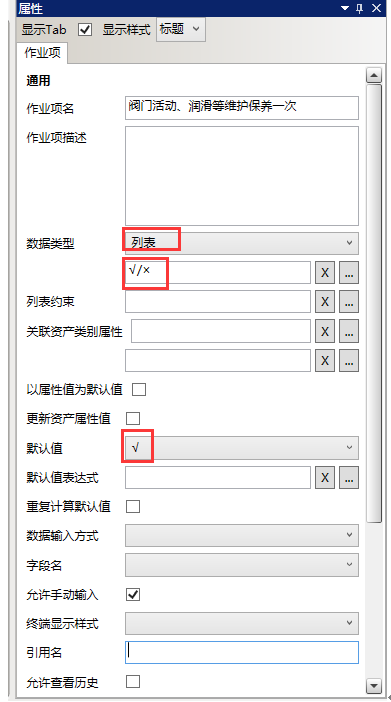
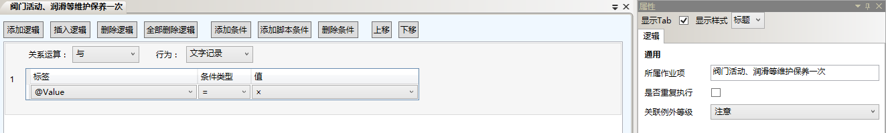
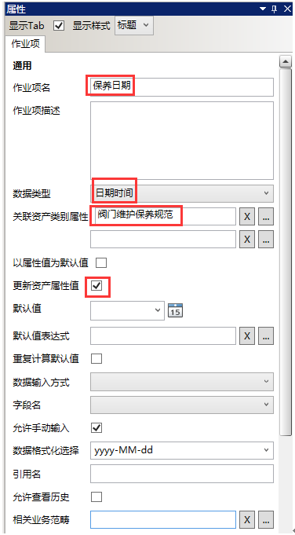
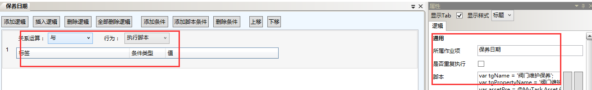

# 主要任务

* 新建“阀门维护保养规范”作业规范，关联资产类别为：阀门。
* 在“阀门维护保养规范”作业规范下新建一个名为“阀门活动、润滑等维护保养一次”的作业项，数据类型为：列表，默认值为：√，其他项默认缺省值（无需配置）。再新建一个“保养日期”的作业项，数据类型为：日期时间，关联资产类别属性为：阀门维护保养规范，其他项默认缺省值（无需配置）验证并发布“阀门维护保养规范”作业规范,
作业项1：阀门活动、润滑等维护保养一次


  

  

* 作业2: 保养日期

  

  

作业项执行脚本信息如下：
````javascript
var tgName = '阀门维护保养'; 
var tgPropertyName = '阀门维护保养'; 
var assetPre = @MyTask.Asset.保养周期;
var assetID = @MyTask.Asset; 
var assetName = @MyTask.Asset.DisplayName; var tsName = '阀门维护保养规范';  
var paraObj = {}; 
var tgValue = ScriptEngine.Context.GetTaskGroupPropertyValue(tgPropertyName); 
if (tgValue) { 
 paraObj = JSON2.parse(tgValue) 
}  
paraObj['TGName'] = tgName; 
paraObj['TGPlanName'] = tgName;  
var now = new Date(); 
var startTime = now.getTime() + assetPre * 24 * 60 * 60 * 1000; 
var endTime = startTime + 1 * 24 * 60 * 60 * 1000;
paraObj['PlanStartTime'] = Common.FormatDateTimeByFormat('yyyy-MM-dd', new 
Date(startTime)); 
paraObj['PlanEndTime'] = Common.FormatDateTimeByFormat('yyyy-MM-dd', new 
Date(endTime)) ;  
paraObj['PlanType'] = 'Plan';  
var addTaskJobs = []; 
if(paraObj['AddTaskJobs']) { 
 addTaskJobs = paraObj['AddTaskJobs']; 
}  
var tjName = assetName + '_' + tsName; 
var find = _.find(addTaskJobs, function (_obj) { 
 return _obj['TJName'] == tjName 
}); 
if(!find){ 
 var obj = {'TSName':tsName,'AssetID': assetID,'TJName':tjName}; 
 addTaskJobs.push(obj); 
}  
paraObj['AddTaskJobs'] = addTaskJobs;  
var newTgValue = JSON2.stringify(paraObj); 
ScriptEngine.Context.SetTaskGroupPropertyValue(tgPropertyName, newTgValue);  
return true;
````

验证并发布“阀门维护保养规范”作业规范,

* 新建一个名为“阀门维护保养”的作业组，作业描述为空，所属组织单元为：生产技术部，所属业务范畴为空，所属业务流程为：阀门维护保养。作业组下引用三次“阀门维护保养规范”作业规范，分别关联阀门F001~阀门F003。
