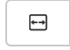
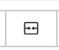
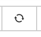
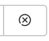
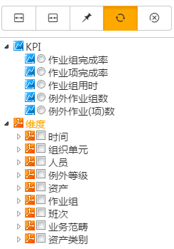

# 分析
A.	对于所有的归档作业组的数据，im企业运营中心的分析模块进行基于关键绩效指标（KPI）的多维度绩效评估，并将评估结果以列表、柱图、饼图、趋势图等形象化的视图呈现给用户。分析页面右侧为筛选器，允许用户根据不同的KPI指标进行数据分析，以在中间KPI分析视图中列出需要的图表，允许用户保存针对KPI分析的查询，并提供给团队和个人使用，这类似于报表模块中的团队和个人查询。
## 按钮说明
：增加宽度
：减少宽度
: 固定
：刷新
：关闭

KPI提供**作业组**完成率、**作业项**完成率、**作业组**用时、例外**作业组**数、例外**作业**（项）数、**作业**覆盖率六类KPI指标的评估分析，每类指标下又细分若干具体量化指标（在KPI视图选择），用户可根据自身关注度选择KPI指标。

