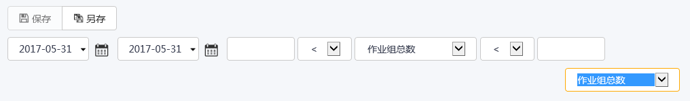

## KPI分析-作业组完成率视图
根据所选筛选器维度、具体量化指标即时动态展示有关**作业组**完成情况和状态的分析图表,使用操作面板可以调节视图体验。 

**作业组**完成率其下细分七个具体量化指标：

* **作业组**总数 - 选择的时间段和维度下所有归档的**作业组**数量。 
* **作业组**按时完成数 - 选择的时间段和维度下按时完成的**作业组**数量。
* **作业组**延时完成数 - 选择的时间段和维度下延期完成的**作业组**数量。 
* **作业组**过期数 - 选择的时间段和维度下过期的**作业组**数量。 
* **作业组**过期率 - **作业组**过期数/作业组总数。
* **作业组**延时完成率 - **作业组**延时完成数/作业组总数。
* **作业组**按时完成率 - **作业组**按时完成数/**作业组**总数。

按钮说明
* 保存—保存至导航栏当前查询。

* 另存为—在导航栏内选择文件夹新建查询保存。

* 导出—将当前分析视图对应的数据表内容导出至Excel。

* 刷新—刷新当前分析视图显示。

操作面板

根据KPI指标不同提供相应的视图辅助工具，如时间范围、视图、量化指标选择等。

* 时间范围—选择查看**作业组**完成率的开始时间和结束时间，缺省为当前日期。

—预设相对时间格式

注意：时间范围选框内可在选取选项后，在其后输入＋、－加减运算符及数字，如“本周初－ 1 ”则指上周初，“本周末－ 1 ”则指上周末，“本月初－ 2 ”则指上上月初。用户可根据需要个性化设置。

—日历，可选择绝对时间格式的具体日期

* 视图—视图辅助工具 
光标停驻可在下来菜单中选择切换图表样式：

：当前以柱状图显示分析结果，为缺省设置 
：当前以饼图显示分析结果 
：当前以折线图显示分析结果 
：显示数据表 

* 可选KPI—排列KPI指标-作业组完成率的具体量化指标供选择。 

**导航栏**：存储分析结果的查询供团队和个人长期应用，也可点击已保存的分析查询，在KPI分析视图中浏览分析结果。  
