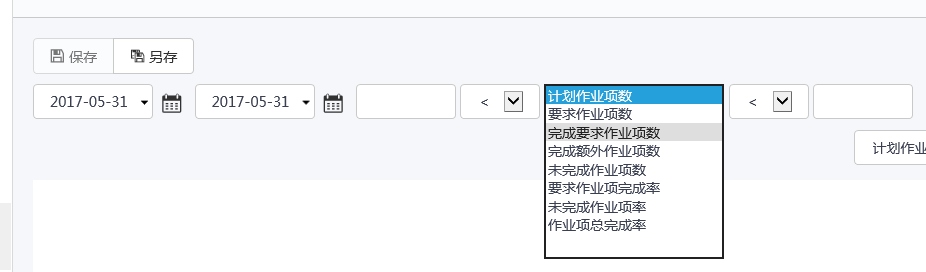

### KPI分析-作业项完成率视图
**作业项**完成率其下细分六个具体量化指标：

* 计划**作业项**数 - 选择的时间段和维度下所有归档的**作业组**中按计划要求完成的**作业项**总数。 
* 要求**作业项**数 - 选择的时间段和维度下所有归档的**作业组**中根据现场情况实际的要求完成的**作业项**总数。
* 完成要求**作业项**数 - 选择的时间段和维度下所有归档的**作业组**中实际完成的要求完成的**作业项**总数。 
* 完成额外**作业项**数 - 选择的时间段和维度下所有归档的**作业组**中实际完成的不要求完成的**作业项**总数，按需完成的**作业项**全部计算为完成的额外**作业项**。 
* 未完成**作业项**数-选择的时间段和维度下所有归档的**作业组**中。
* 要求**作业项**完成率 - 完成要求**作业项**数/要求**作业项**数 。 
* 未完成**作业项**率-未完成**作业**数/要求**作业项**数。
* **作业项**总完成率 - （完成要求**作业项**数+完成额外**作业项**数）/要求**作业项**数。

