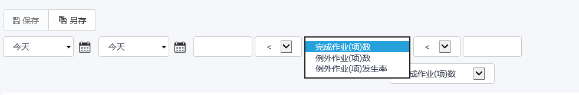

## KPI分析-例外作业（项）数视图
选择的时间段和维度下所有归档的**作业组**中发生了例外的**作业项**数量，**作业项**完成率其下细分三个具体量化指标： 
* 完成**作业**（项）总数 - 选择的时间段和维度下所有归档的**作业组**的**作业项**总数.
* 例外**作业**（项）数 -  选择的时间段和维度下所有归档的**作业组**中发生了例外的**作业项**数量。 
* 例外**作业**（项）发生率 -例外**作业**（项）数/**作业**（项）总数。

