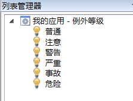
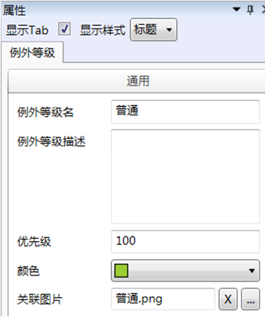

# 例外等级

在imgenius企业移动现场作业管理软件中，使用列表管理器的例外等级选项卡来预设例外等级列表。

系统预设了如下图的例外等级：

  

  * 普通，例外等级100，图标   ，颜色   

  * 注意，例外等级200，图标   ，颜色   

  * 警告，例外等级300，图标   ，颜色  

  * 严重，例外等级400，图标   ，颜色   

  * 事故，例外等级500，图标   ，颜色  

  * 危险，例外等级600，图标   ，颜色    

一个例外等级的属性如下图，其中优先级别的取值范围为1到999，数值越大等级越高。

  

例外等级列表数据将用于在作业管理器配置作业项逻辑，作为关联例外等级的备选项。

> [!warning] 
> 用户定义时可对这些缺省数据进行修改。也可以使用例外等级列表任意添加新的例外等级。
