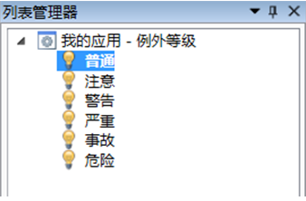
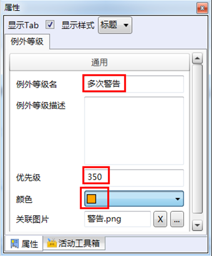
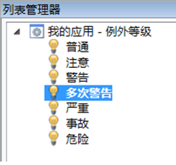

# 详细步骤

* 将“普通”例外等级的优先级从100改为50

  * 选中“普通”例外等级

    

  * 在右边属性框中，将优先级从100改为50

* 添加“多次警告”例外等级，优先级为350，颜色为橙色，关联图片同“警告”所关联的图片。

  * 右键“警告”例外等级，在弹出快捷菜单中选择复制
  * 右键我的应用—例外等级，在弹出的快捷菜单中选择粘贴
  * 选中“警告-副本”例外等级，在属性对话框中做如下修改：

    

  * 选中“多次警告”，按住Ctrl + ↑3次，将“多次警告”的顺序调整至“警告”和“严重”之间，如图：

     