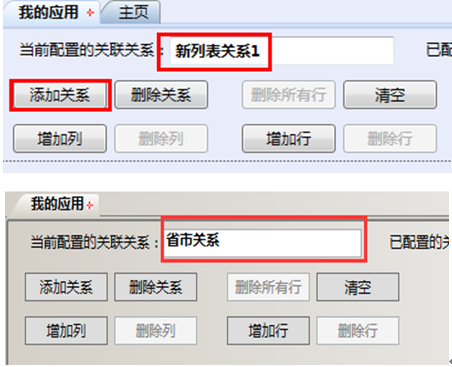
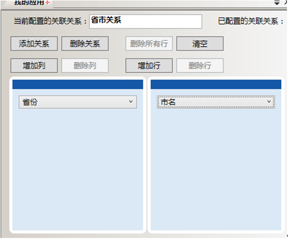
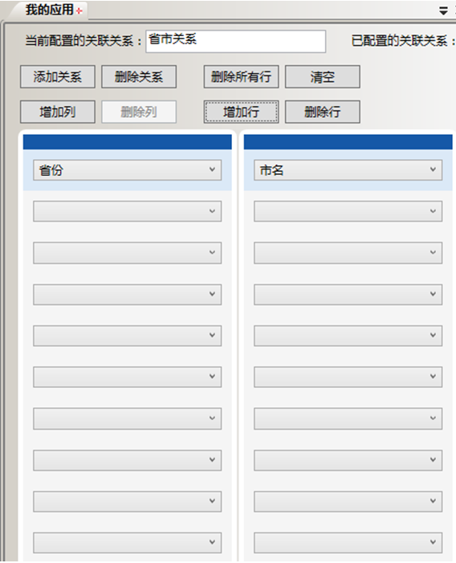
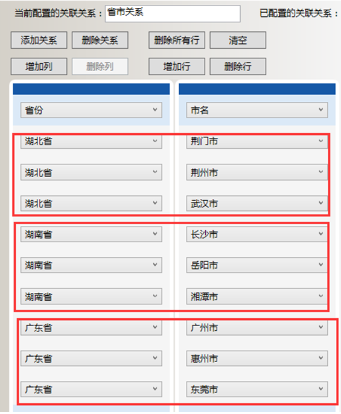
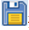

# 详细步骤

* 配置名为“省市关系”的关联联系

  * 选中我的应用-自定义列表，右击，在快捷菜单栏中选中选择配置关联关系，如图：
单击“添加关系”新建一个关联关系，并且在“当前配置的关联关系”中将其名称改为：例外类别约束，如图：

    

  * 因为是两个列表的关联关系所以单击两次增加列，分别对应这两个列表，每列的第一行选择本列所代表的列表名，如图：

    

  * 因为例外类别有三个列表项，每一个列表项都关联三个例外列表的列表项，所以单击九次增加行分别对应这九种关联关系，如图：

    

  * 按照“主要任务”中的描述配置关联关系，配置完成后如图：

    

  * 配置完成后单击保存 按钮，保存完毕后关闭。