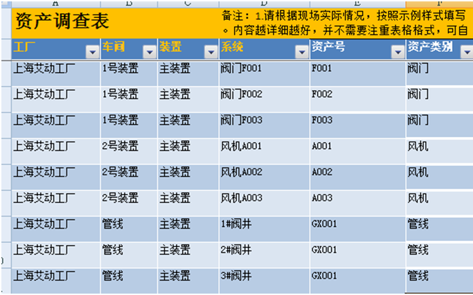

# 主要任务

* 按下表添加2个资产“1号装置”、“2号装置”。

|资产名|资产号|资产描述|资产类别|位置点|位置名称|扫描点|
|:-:|:-:|:-:|:-:|:-:|:-:|:-:|
|1号装置|	无|	无|	无|	不勾选|	无|	不勾选|
|2号装置|	无|	无|	无|	不勾选|	无|	不勾选|
|管线|	无|	无|	无|	不勾选|	无|	不勾选|

* 按下表为“1号装置”添加子资产。

|资产名|资产号|资产描述|资产类别|位置点|位置名称|扫描点|
|:-:|:-:|:-:|:-:|:-:|:-:|:-:|
|阀门F001|	F001|	无|	阀门|	不勾选|	无|	勾选|
|阀门F002|	F002|	无|	阀门|	不勾选|	无|	勾选|
|阀门F003|	F003|	无|	阀门|	不勾选|	无|	勾选|

* 按下表为“2号装置”添加子资产。

|资产名|资产号|资产描述|资产类别|位置点|位置名称|扫描点|
|:-:|:-:|:-:|:-:|:-:|:-:|:-:|
|风机A001|	A001|	无|	风机|	不勾选|	无|	勾选|
|风机A002|	A002|	无|	风机|	不勾选|	无|	勾选|
|风机A003|	A003|	无|	风机|	不勾选|	无|	勾选|

* 查看泵的资产属性，并按下表配置资产属性初始值

|阀门F001|	阀门F002|	阀门F003|
|:-:|:-:|:-:|:-:|:-:|:-:|:-:|
|保养周期|	30天|	60天|	30天|
|上次保养时间|	2018-4-13|	2018-4-13|	2018-4-13|
