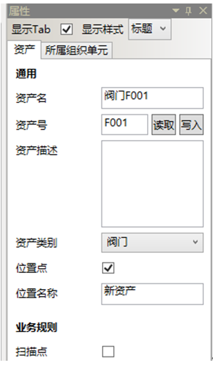

# 详细步骤

* 按照下表新建资产“1号装置”、“2号装置”

|资产名|资产号|资产描述|资产类别|位置点|位置名称|扫描点|
|:-:|:-:|:-:|:-:|:-:|:-:|:-:|
|1号装置|	无|	无|	无|	不勾选|	无|	不勾选|
|2号装置|	无|	无|	无|	不勾选|	无|	不勾选|

在导航栏→列表管理器→资产内选择我的应用-资产，右击，在快捷菜单中选择新建。

选中新资产，在右边属性栏修改资产名为：1号装置

同上创建资产“2号装置”，如图：

* 按下表为“1号装置”添加子资产。

|资产名|资产号|资产描述|资产类别|位置点|位置名称|扫描点|
|:-:|:-:|:-:|:-:|:-:|:-:|:-:|
|阀门F001|	F001|	无|	阀门|	不勾选|	无|	勾选|
|阀门F002|	F002|	无|	阀门|	不勾选|	无|	勾选|
|阀门F003|	F003|	无|	阀门|	不勾选|	无|	勾选|

选中“1号装置”，右击，在快捷菜单栏中选择新建，如图： 

选中新资产，在右边属性栏修改资产名为：泵P4001。

在右边属性栏配置其他项，资产号为：F4001资产类别为：阀门，位置点：不勾选，位置点名称：空，扫描点：空，其他项空置，如图：

根据表格同上步骤配置其他资产，如图：

配置完成后单击保存按钮，保存后关闭完成。

* 验证资产

选中我的应用—资产，右击，在快捷菜单栏选择验证—全部验证，如图：

单击全部验证后，系统弹出验证正常对话框，如图：

