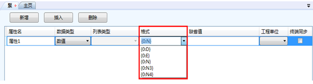

# 数值数据类型

imgenius使用数值数据类型来表示一个模拟量，数值数据类型包括整型、浮点数（科学计数法表示）和带小数的数值类型。数值数据的类型通过格式来定义。imgenius的缺省数据格式如下图：

格式：

{0:D} ：为整数

{0:E} ：浮点型

{0:N} ：表示有两位小数的实数，等同于{0:N2}

{0:N3}：表示有三位小数的实数

{0:N4}：表示有四位小数的实数

格式也可以自行定义，例如：可以输入{0:N1}来表示带有一位小数的实数类型或{0:N6}来表示带有六位小数的实数类型，以此类推。

数值数据类型通常还需要定义工程单位，工程单位可以在列表管理器-工程单位中配置和修改。

