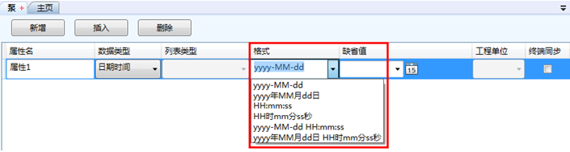
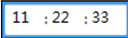
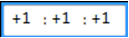

# 日期时间数据类型

imgenius使用日期时间数据类型来表示时间，日期时间数据类型有六种格式，如下图：

  

其中包括两种日期类型，两种时间类型和两种日期和时间类型。不同的格式对应不同的初始数据。

 * 日期类型

日期类型的初始数据可以由日历工具来设定一个绝对日期，也可以由imgenius预定义的日期名来设定一个相对日期，这些日期名包括：今天、本周末、本月末、本周初、本月初、本季初、本季末。还可以使用加减法来表示和这些预定义日期名相同单位的偏移量。

 示例：
 
 “今天-2”表示前天。

 “本周初-1”表示上周初。

 * 时间类型

时间类型的初始数据由 时间设定工具来设定。

 示例： 
 
  表示上午11点22分33秒。
 
  表示当前时间的时分秒各加1后计算出的时间。

 * 日期和时间类型

日期和时间类型的初始数据由以上两种方法共同设定。

