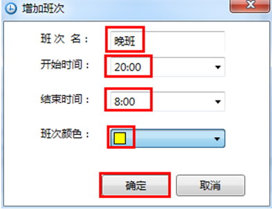

# 详细步骤

* 新建轮班“早晚班”

  在导航栏→列表管理器→轮班内右键我的应用-轮班，在快捷菜单中选择新建，如图：

  

  选中“新轮班”，在右边属性栏将轮班名改为：早晚班，如图：

  

* 添加班次“早班”，上班时间为：8:00，下班时间为：20:00，代表颜色为红色。

  选中“早晚班”，右击，在快捷菜单栏中选择配置，进入到配置轮班界面，如下图：

  

  

  在主界面双击任意时间条，弹出配置窗口，如下图：

    

  在“增加班次”窗口中配置班次名为：早班，开始时间为：8:00，结束时间为：20:00，班次颜色为：红色。

  

  配置完成后单击确定，配置界面显示如下：

  

* 添加班次“晚班 ”，上班时间为：20:00，下班时间为8:00，代表颜色为黄色。

  根据“早班”配置步骤配置，“晚班”配置如图：

  

  配置完成后单击确定，配置界面显示如下：

   

  保存轮班配置。 

   