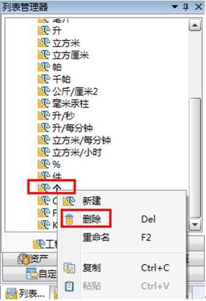
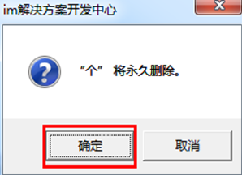
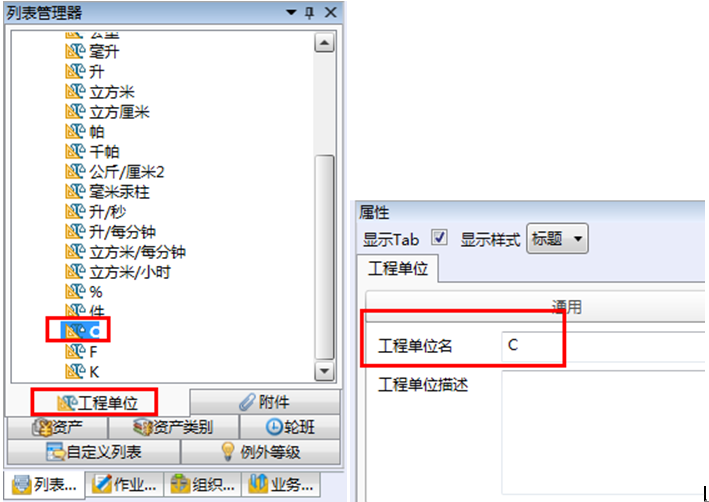
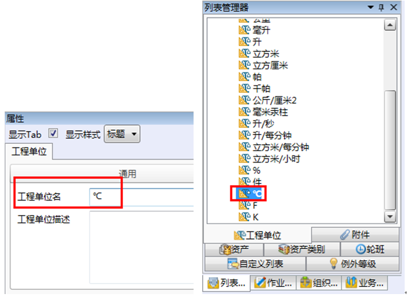
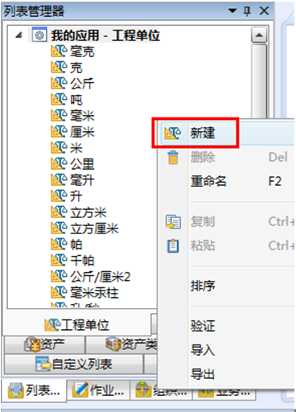
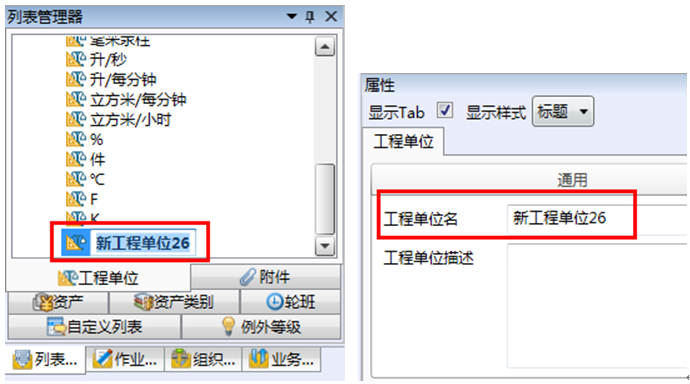
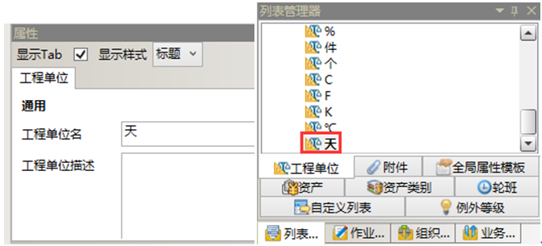

# 详细步骤

* 删除“个”、“件”这两个工程单位
  * 选中并右击工程单位“个”，在快捷菜单栏中选择“删除”，如图：

  

  * 点击“删除”后，系统弹出如下对话框，单击确定确认删除工程单位“个”，如图：

    

  * 同上删除工程单位“件”

* 修改温度单位“C”为 “ºC”

  * 选中工程单位“C”，在右边属性框的工程单位名一栏中修改工程单位名称为：“ºC”，如图：

    

    

* 添加工程单位“天”

  * 在列表管理器→工程单位任意位置右击，弹出快捷菜单栏，选择“新建”，如图：

      

  * 单击“新建”后，选中“新工程单位26”，在右边属性栏工程单位名一栏中将工程单位名修改为：bar，如图：

    
       
       