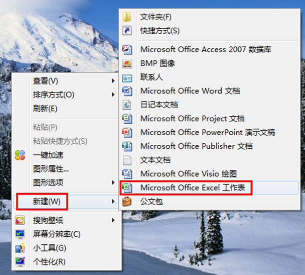
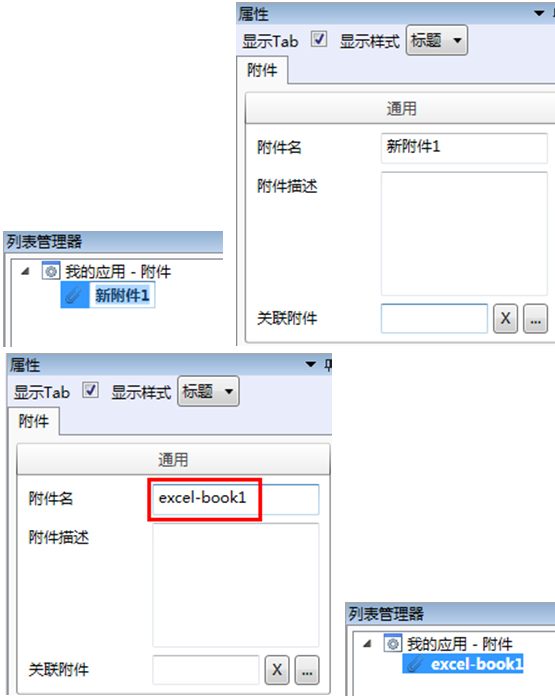
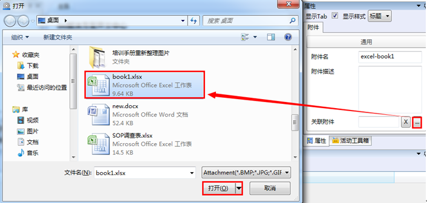
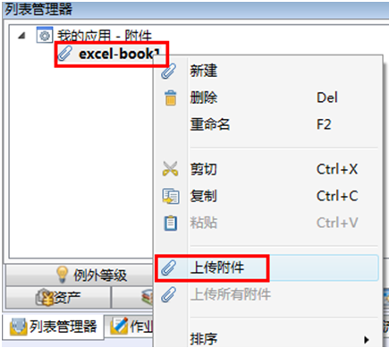
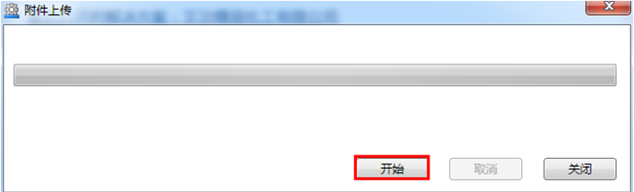

# 详细步骤

* 新建一个excel文档，名称为“book1”，并将此文档储存至桌面。
  * 在桌面空白处右击，在菜单栏中选择新建-Microsoft Office Excel 工作表。

    

  * 新建工作表后直接将工作表改名为：book1

      

* 将此文档配置成附件，附件名为“excel-book1”，附件描述为：空。

  * 回到SDC，在导航栏→列表管理器→附件内选择我的应用-附件，右键，在快捷菜单选择新建。
选中新建的新附件1，在右边属性框中，将附件名改为“excel-book1”，附件描述为：空。

     

  * 点击关联附件文本框右侧的扩展图标 ，在打开对话框中选择桌面，然后选择book1.xlsx。

     

  * 在导航栏→列表管理器→附件内选中excel-book1附件，右键，在快捷菜单栏中选择上传附件，如下图：

       

  * 点击上传附件后，系统弹出附件上传进度条，单击开始，上传结束后，单击关闭完成。

       