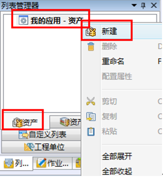
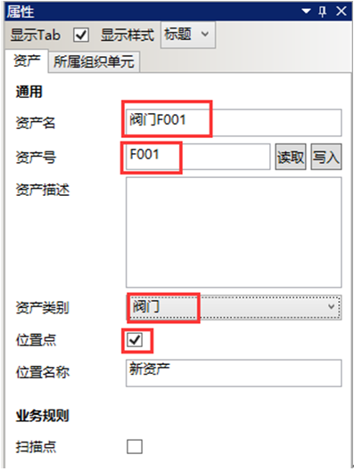

# 新建资产

* 在导航栏→列表管理器→资产内选择我的应用-资产，右击，在快捷菜单中选择新建。

  

* 选中新资产，在右边属性栏编辑各属性。

  

  资产右边属性框配置

  示例：如图

  

  * 资产名：设定资产的名称。

  * 资产号：设定资产编码。此编码在需要使用现场手持终端扫描时为资产的条形码或RFID编码。

  * 资产描述：资产的说明文字。

  * 资产类别：选择相应的资产类别。空表示不属于任何资产类别的资产。

  * 位置点：勾选位置点，可将此资产的位置定义为一个系统的位置标记。

  * 位置名称：资产位置所代表的位置标记的名称。
  
  * 扫描点：勾选此选项表示资产设置了条形码或RFID编码，此编码应该与资产号相同。
