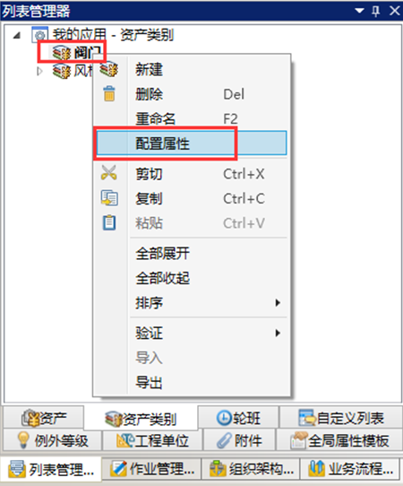
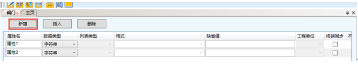
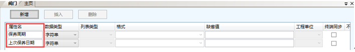
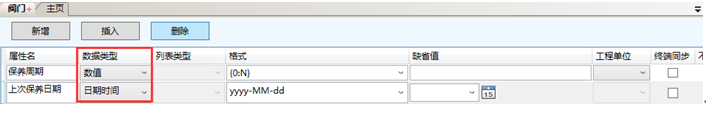
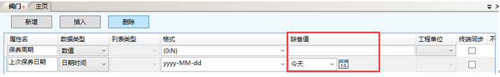
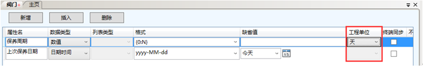
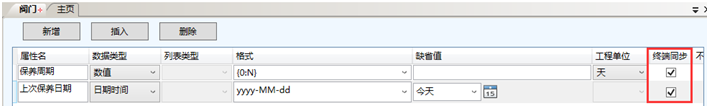

# 配置资产类别属性

* 选中一个资产类别（例如“阀门”）右击，在快捷菜单中选择配置属性，如图：

  

* 连续单击2次新增，添加2个资产属性，如图：

  

* 按照下图依次修改属性名，如图：

  

* 按照下图依次修改数据类型，如图：

  

* 按照下图修改缺省值，如图：

  

* 按照下图修改工程单位，如图：

  

* 终端同步全部勾选，如图：

  