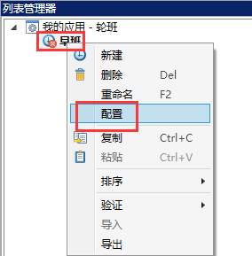
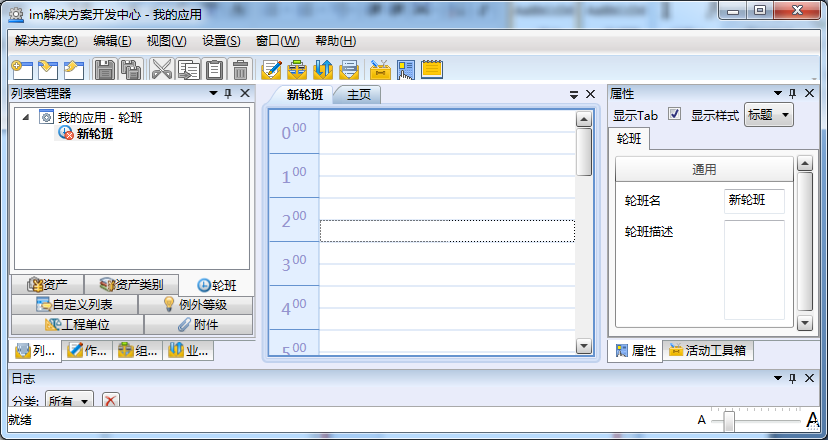
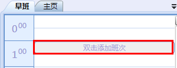
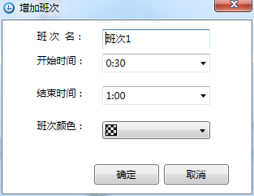
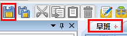

# 配置轮班

* 双击当前轮班或选中当前轮班，右击选择配置，如图：

  

* 系统主工作区内出现新轮班配置界面，如图：

  

* 在配置界面双击任意时间条，弹出“增加班次”对话框，如下图：

  

  

* 使用此对话框定义一个班次的名称、开始时间、结束时间和班次代表颜色。一个轮班中可以包含多个班次。

* 配置完成后，保存轮班的配置信息，如图：

  

* 选中某一轮班右键的快捷菜单中还有如下功能：
  * 删除—删除选中轮班 
  * 重命名—修改选中轮班的名称 
  * 复制—复制选中轮班 
  * 粘贴—粘贴已复制的轮班 
  * 排序—更改选中轮班在列表中的顺序 
  
    * 上移 
    * 下移

  * 验证—手动验证添加或修改的轮班是否正确有效 
  
    * 验证 — 验证当前轮班
    * 重新验证 —重新验证当前轮班
