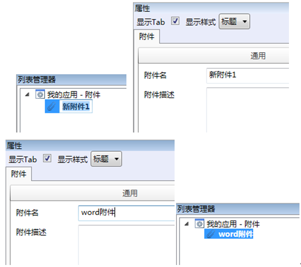

# 新建附件

* 在导航栏→列表管理器→附件内选择我的应用-附件，右键，在快捷菜单中选择新建。

  

* 选中“新附件1”，在右边属性栏中修改附件名和附件描述（例如修改附件名为： word附件）

  

* 在右边属性栏关联附件选择框中单击扩展 按钮，添加一个附件（例如word附件），如下图：

  

* 在关联附件中添加完成后，选中该附件，右击，在快捷菜单栏种选择上传附件，操作如下图：

  

* 单击上传附件后，系统弹出附件上传进度框，单击开始，上传结束后，单击关闭完成。

  